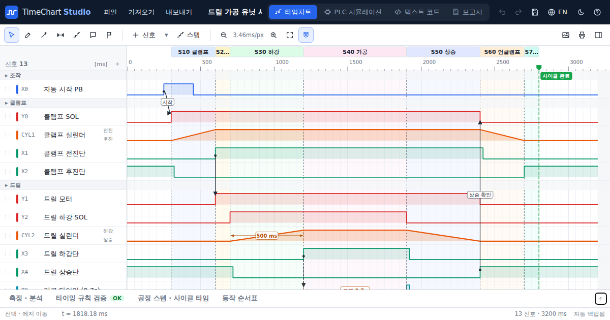

# TimeChart Studio

**자동화 설비의 타임차트를 그리고, PLC 프로그램으로 자동으로 만들고, 보고서(PDF)로 뽑는 무료 도구**입니다.

### ▶ 바로 쓰기: https://mioon1402.github.io/TimeChartForAutomation/

첫 주소는 무엇을 하는 도구인지 보여 주는 소개 페이지이고, **바로 시작하기**를 누르면 편집기(`…/TimeChartForAutomation/app/`)가 열립니다. 자주 쓰면 편집기 주소를 즐겨찾기하세요. 설치나 회원가입 없이 크롬·엣지에서 바로 열립니다. 인터넷이 막힌 PC에서는 [오프라인 파일(TimeChartStudio.html)](https://mioon1402.github.io/TimeChartForAutomation/TimeChartStudio.html)을 받아 더블클릭하세요.



- 여는 PLC 프로그램과 차트는 **서버로 보내지 않습니다.** 모든 계산은 각자의 브라우저 안에서만 합니다.
- 문제 신고와 기능 제안은 [Issues](https://github.com/mioon1402/TimeChartForAutomation/issues)에 남겨 주세요.
- [English summary](#english)

---

## 1. 한눈에 보기 (처음 보는 분을 위한 설명)

### 타임차트가 뭔가요?
설비가 한 사이클 동안 **언제 무엇이 켜지고 꺼지는지**를 시간 순서대로 그린 그림입니다.
가로축은 시간, 세로로는 신호(버튼, 솔레노이드, 센서, 모터…)가 한 줄씩 놓입니다.

```text
시간 →            0      0.5s     1.0s     1.5s     2.0s
시작 버튼   X0   _|‾‾|__________________________________
클램프 SOL  Y0   ____|‾‾‾‾‾‾‾‾‾‾‾‾‾‾‾‾‾‾‾‾‾‾‾‾‾|________
클램프 실린더    ____/‾‾‾‾‾‾‾‾‾‾‾‾‾‾‾‾‾‾‾‾‾‾‾‾‾‾\_______   ← 경사 = 움직이는 시간
전진단 센서 X1   _________|‾‾‾‾‾‾‾‾‾‾‾‾‾‾‾‾‾‾‾‾|________
                 [S10 클램프][S20 가공 ......][S30 언클램프]  ← 공정 스텝
```

설비 사양서, 매뉴얼, 사이클 타임 검토, 고객 보고서에 들어가는 그림이 바로 이것입니다.

### 이 프로그램이 해 주는 일
1. **그리기**: 마우스로 ON/OFF 파형을 그립니다. 실린더 이동 시간은 경사선으로, 공정 스텝은 색 띠로 표시하고, "이 신호 때문에 저 신호가 켜진다"는 화살표와 시간 치수선을 넣을 수 있습니다.
2. **PLC 프로그램으로 자동 생성**: PLC 프로그램(래더를 니모닉으로 뽑은 것)을 넣으면 PLC가 도는 것처럼 계산해서 타임차트를 자동으로 그려 줍니다. LS XG5000은 **니모닉(IL)을 PDF로 인쇄한 파일을 그대로 열면** 됩니다.
3. **검토와 보고서**: 사이클 타임과 가장 오래 걸리는 스텝(병목)을 계산하고, "SOL이 켜지고 0.4초 안에 센서가 들어와야 한다" 같은 규칙을 자동으로 OK/NG 판정합니다. 결과는 도면 표제란(작성/검토/승인)이 있는 PDF 보고서로 뽑습니다.

### 이렇게 흘러갑니다

```text
 ┌──────────────────┐   ┌───────────────────┐   ┌─────────────┐   ┌──────────────┐
 │ PLC 프로그램      │   │ 시뮬레이션          │   │ 타임차트      │   │ 보고서        │
 │ · XG5000 IL PDF  │ → │ · 스캔 계산         │ → │ · 마우스 수정 │ → │ · PDF 인쇄    │
 │ · GX Works CSV   │   │ · 실린더/센서 응답   │   │ · 규칙 검증   │   │ · PNG / 엑셀  │
 │ · 직접 그리기     │   │   자동 흉내         │   │ · 사이클 타임 │   │              │
 └──────────────────┘   └───────────────────┘   └─────────────┘   └──────────────┘
```

---

## 2. 실행하기 (어디서 여나요?)

두 가지 방법이 있고, 기능은 똑같습니다.

| 방법 | 이럴 때 | 여는 법 |
|---|---|---|
| **웹 주소** | 인터넷이 되는 PC, 태블릿, 휴대폰 | https://mioon1402.github.io/TimeChartForAutomation/ (소개 페이지) → 바로 시작하기, 또는 편집기 바로 가기 `…/TimeChartForAutomation/app/` |
| **오프라인 파일** | 공장 PC, 사내망처럼 인터넷이 막힌 곳 | 파일 1개(약 2.5MB)를 받아서 더블클릭 |

### 웹 주소로 열기
- 첫 주소는 **소개 페이지**입니다. 무엇을 할 수 있는지, 타임차트가 처음인 사람을 위한 설명, XG5000 PDF 로 만드는 법이 있고, 이 브라우저에 하던 작업이 있으면 **이어서 작업하기** 버튼이 나옵니다.
- 소개 페이지의 버튼은 편집기의 원하는 화면으로 바로 갑니다: `app/#tutorial`(차트 그리기 튜토리얼), `app/#tutorial-plc`(PLC 튜토리얼), `app/#practice`(연습 문제), `app/#wizard`(순서대로 만들기), `app/#plc`(PLC 탭).
- 크롬 또는 엣지를 권장합니다. 편집기를 처음 열면 시작 화면에서 **예제 차트 둘러보기 / PLC 프로그램으로 만들기 / 순서대로 새로 만들기** 중 하나를 고릅니다.
- 휴대폰에서도 열리지만, 편집과 보고서 출력은 마우스가 있는 PC가 편합니다.
- 새 기능이 나오면 같은 주소에서 바로 반영됩니다.

### 오프라인 파일 받기
- 웹 주소에서 오른쪽 위 `?`(도움말) → **오프라인 버전 받기**를 누르거나, [TimeChartStudio.html](https://mioon1402.github.io/TimeChartForAutomation/TimeChartStudio.html)을 바로 받습니다.
- 저장소의 `release/TimeChartStudio.html`과 같은 파일입니다.
- 받은 파일을 **더블클릭**하면 기본 브라우저로 열립니다. 인터넷 연결이 필요 없고, USB나 사내 공유 폴더로 다른 PC에 복사해서 써도 됩니다.

### 내 파일은 안전한가요?
- 여는 PLC 프로그램이나 차트는 **어디로도 전송되지 않습니다.** 웹 주소로 열어도 파일을 읽고 계산하는 일은 모두 내 브라우저 안에서만 합니다.

### 작업 내용은 어디에 저장되나요?
- **자동 백업**: 고친 내용은 브라우저에 자동으로 보관돼서, 창을 닫았다 다시 열어도 이어서 할 수 있습니다. 다만 같은 PC, 같은 브라우저에서만 남아 있습니다.
- **파일로 저장**: `Ctrl+S`를 누르면 `.tchart` 파일로 저장됩니다. 다른 PC로 옮기거나 보관할 때는 이 파일을 쓰세요. `Ctrl+O`로 다시 엽니다.

---

## 3. 5분 따라하기

> **앱 안에 따라 하기 튜토리얼이 있습니다.** 처음 열면 나오는 시작 화면, 또는 오른쪽 위 `?`(도움말)에서 **차트 그리기 기초** / **PLC 프로그램으로 차트 만들기**를 누르세요. 누를 버튼을 하나씩 짚어 주고, 해 보면 저절로 다음으로 넘어갑니다. 끝나면 원래 차트로 돌아옵니다.

직접 읽으며 해 보려면:

1. **예제 보기**: 처음 열면 나오는 시작 화면에서 `예제 차트 둘러보기`를 누르면 "드릴 가공 유닛" 예제 차트가 나옵니다. 상단 `파일 → 템플릿`에서 로봇 핸드셰이크, 인버터 컨베이어 예제도 열 수 있습니다.
2. **파형 고치기**: 왼쪽 위 연필(그리기, `D` 키)을 누르고 신호 줄에서 마우스로 끌면 ON/OFF가 뒤집힙니다. 화살표(선택, `V` 키) 상태에서 파형이 바뀌는 지점을 끌면 시간이 옮겨집니다. 틀리면 `Ctrl+Z`로 되돌립니다.
3. **PLC 프로그램으로 만들기**: 상단 `PLC 시뮬레이션` 탭 → `예제 불러오기…`에서 "LS XGK - 픽앤플레이스"를 고르고 → 오른쪽 아래 `▶ 시뮬레이션 → 타임차트 생성`을 누릅니다.
4. **보고서 뽑기**: `보고서` 탭 → `인쇄 / PDF 저장`을 누르고 → 프린터를 "PDF로 저장"으로 고릅니다.

### 내 설비의 타임차트를 처음부터 만들기 (작성 도우미)

실무에서 타임차트는 파형부터 그리지 않습니다. 설계 순서가 있고, 타임차트는 그 결과물입니다.

| 순서 | 하는 일 | 왜 필요한가 |
|---|---|---|
| ① 설비 사양 | 어떤 설비인지, 한 사이클을 몇 초 안에 끝내야 하는지(목표 사이클 타임, 택트 타임) 정합니다. | 목표가 있어야 나중에 "시간 안에 들어오는가"를 판단합니다. |
| ② 동작 기기 | 움직이는 것(실린더, 모터, 흡착·척)을 적고, 한쪽 끝에서 반대쪽 끝까지 걸리는 **동작 시간**을 적습니다. | 차트의 막대 길이와 경사선이 이 시간입니다. 모르면 0.5초로 두고 시운전 뒤 실측값으로 고칩니다. |
| ③ I/O 목록 | 기기마다 PLC 가 켜는 **출력**(솔레노이드 SOL, 모터)과 PLC 가 읽는 **입력**(시작 버튼, 끝 위치 센서)을 정하고 주소(X0, Y0 / P00000 / I0.0)를 붙입니다. | 제어 설계(PLC 프로그램, 배선도)와 같은 이름·주소를 쓰기 위해서입니다. |
| ④ 동작 순서 | 한 사이클 동안 무엇이 먼저 움직이고, 무엇이 동시에 움직여도 되는지 정합니다. 보통은 앞 동작이 끝났다는 센서를 확인한 뒤 다음 동작을 시작합니다. | 동시에 움직여도 부딪히지 않는 동작을 겹치면 사이클 타임이 줄어듭니다. 마지막에는 모든 기기가 원위치로 돌아와야 다음 사이클을 시작합니다. |
| ⑤ 타임차트 · 검토 | 위 내용으로 차트를 그리고, 목표 사이클 타임 안에 들어오는지, 동시에 켜지면 안 되는 출력(전진 SOL 과 후진 SOL)이 겹치지 않는지 확인한 뒤 작성·검토·승인합니다. | 이 차트가 PLC 프로그램 작성과 시운전의 기준이 됩니다. |

이 프로그램의 **작성 도우미**가 이 순서를 그대로 따라갑니다. `파일 → 새 차트: 순서대로 만들기…` 또는 시작 화면의 **순서대로 새로 만들기**를 누르세요.

1. **설비**: 설비 이름, 도면 번호, 작성자, 목표 사이클 타임(초)을 적습니다.
2. **동작 기기**: 예시로 "클램프", "프레스"가 들어 있으니 고쳐 씁니다. 종류는 네 가지입니다.
   - 실린더 (더블 SOL): 전진 SOL 과 후진 SOL 두 개. 신호를 끊어도 그 자리에 머뭅니다. 차트에는 움직이는 동안만 SOL 이 켜집니다.
   - 실린더 (싱글 SOL): SOL 하나. 켜 두는 동안 전진해 있고, 끄면 스프링으로 돌아옵니다.
   - 모터: 운전 출력 하나. 기동부터 정지까지 켜져 있습니다.
   - 흡착 · 척: SOL 하나와 흡착(잡힘) 확인 센서.
   동작 이름은 "전진/후진", "하강/상승", "잡기/놓기"처럼 바꿀 수 있습니다(`자주 쓰는 이름…`).
3. **I/O 목록**: 기기에서 입력·출력을 자동으로 뽑아 번호를 매깁니다. 주소 방식(미쓰비시 8진수 X0·Y0 / LS P00000·P00040 / 지멘스 I0.0·Q0.0 / 주소 없이)을 고르고, 실제 배선과 다른 주소나 이름만 고칩니다.
4. **동작 순서**: `자동 제안`을 누르면 "기기 순서대로 가기 → 작업 대기 → 거꾸로 돌아오기"가 들어갑니다. 줄마다 동작을 고르고, 시작 조건을 **앞 동작이 끝난 뒤** 또는 **앞 동작과 동시에**로 정합니다. 가공·가압처럼 기다리는 시간은 `대기 추가`로 넣습니다. 이미 그 위치인 기기를 또 움직이거나, 사이클이 끝났는데 원위치로 돌아오지 않은 기기가 있으면 "검토할 점"으로 알려 줍니다.
5. **확인 · 만들기**: 예상 사이클 타임, 목표 대비 OK/NG 와 여유 시간, 단계별 막대를 보고 `타임차트 만들기`를 누릅니다.

만들어지는 차트에는 이런 것이 들어갑니다.
- 기기별 그룹: 출력(SOL, 모터) 파형, 실린더 동작선(경사 = 동작 시간), 끝 위치 센서 파형(원위치 센서는 떠나는 순간 꺼지고 돌아오면 켜짐)
- 대기 타이머 행, 공정 스텝 띠(S10, S20 …), "센서 확인 → 다음 동작" 화살표, 사이클 완료 표시
- 검토 규칙: 목표 사이클 타임, 더블 SOL 실린더마다 "전진/후진 SOL 동시 ON 금지". 결과는 아래 `타이밍 규칙 검증` 탭과 보고서에 나옵니다.

만든 뒤에도 파형을 직접 고칠 수 있고, `파일 → 동작 순서 고치기…`로 도우미를 다시 열어 순서나 시간을 바꾼 뒤 다시 만들 수 있습니다. 다시 만들면 차트에서 직접 고친 내용은 사라지므로, 순서가 확정된 뒤에 세부를 손보는 것이 좋습니다.

### 연습 문제: 직접 그려 보고 채점받기

타임차트는 읽을 줄 아는 것과 직접 그릴 줄 아는 것이 다릅니다. `배우기 → 연습 문제` (또는 시작 화면, 도움말 `?`)에서 문제를 골라 직접 그려 보고 채점받을 수 있습니다.

**푸는 방법**
1. 문제를 고르면 차트가 연습용으로 바뀝니다. 위쪽 **① 주어진 입력**(버튼을 누른 시각 등)은 그대로 두고, 아래쪽 **② 그려야 할 신호**를 그립니다.
2. 아래 **연습 문제** 칸에 문제, 배우는 것, 주어진 조건, 그릴 것이 적혀 있습니다. PLC 문제에는 래더 그림과 니모닉(미쓰비시)이 함께 나옵니다.
3. 연필(그리기) 도구로 그립니다. `Shift` 를 누르고 끌면 ON, `Alt` 를 누르고 끌면 OFF 로 칠해집니다. 눈금(0.1초)에 자동으로 붙습니다.
4. **채점하기**를 누르면 신호마다 맞았는지 알려 줍니다. 틀렸으면 "2초에 OFF 되어야 하는데 2.5초에 OFF 되었습니다", "ON 구간이 2번 있어야 하는데 1번 그렸습니다", "시작할 때(0초) ON 이어야 합니다"처럼 어디가 다른지 구체적으로 알려 줍니다. 시각은 눈금 한 칸(0.1초) 안이면 맞은 것으로 봅니다.
5. 막히면 **힌트**를 하나씩 열어 봅니다(문제마다 2~3개). **정답 보기**로 정답 차트를 보고 **내 답 보기**로 돌아올 수 있습니다. **해설**에는 몇 초에 무엇이 왜 일어나는지 단계별 설명과 실무 메모가 있습니다.
6. 맞힌 문제는 문제 목록에 ✓ 와 점수가 남습니다(이 브라우저에만 저장). **연습 끝내기**를 누르면 연습 전 차트로 돌아옵니다.

**PLC 읽기: 프로그램을 보고 출력 파형 그리기** (정답은 내장 PLC 시뮬레이터로 계산)

| 번호 | 난이도 | 문제 | 배우는 것 |
|---|---|---|---|
| 1 | 기초 | 자기유지 회로 | 버튼을 떼도 출력이 유지되는 자기유지, 정지 버튼을 B접점으로 쓰는 이유 |
| 2 | 기초 | ON 딜레이 타이머 | 입력이 계속 켜져 있는 동안만 시간을 세고, 꺼지면 처음부터 다시 센다 |
| 3 | 중급 | 버튼 한 개로 켜고 끄기 | PLS(상승 펄스)는 누른 순간 한 스캔만 켜진다, 누를 때마다 바뀌는 토글 |
| 4 | 중급 | 정·역회전 인터록 | 동시에 켜지면 안 되는 두 출력을 서로의 B접점으로 막기 |
| 5 | 중급 | 카운터: 3개 모이면 알림 | 켜질 때마다 하나씩 세기, 설정값 도달, 리셋, 스캔 순서에 따른 한 스캔 지연 |
| 6 | 중급 | 깜빡이(플리커) 회로 | 타이머 두 개가 서로 리셋하며 일정 주기의 ON/OFF 만들기 |
| 7 | 응용 | 순차 기동 (1초 간격) | 타이머를 이어 여러 출력을 차례로 켜기, 공통 정지로 한꺼번에 끄기 |
| 8 | 응용 | 컨베이어 정지 지연 | 입력이 꺼진 뒤 일정 시간 뒤에 끄는 OFF 딜레이를 ON 딜레이로 만들기 |
| 9 | 응용 | 실린더 동작 시간 초과 알람 | 정해진 시간 안에 끝단 센서가 안 오면 알람(자기유지)을 내고 SOL 을 끊는 타임아웃 감시 |

**설비 동작: 설명을 보고 솔레노이드 · 센서 파형 그리기** (정답은 작성 도우미와 같은 계산)

| 번호 | 난이도 | 문제 | 배우는 것 |
|---|---|---|---|
| 1 | 기초 | 실린더 한 개 왕복 | 출력 ON → 출발(출발한 쪽 센서 OFF) → 도착(도착한 쪽 센서 ON) → 다음 동작의 순서 |
| 2 | 기초 | 싱글 솔레노이드 스토퍼 | 싱글 SOL 은 켜 두는 동안만 그 위치, 대기 타이머 표시 |
| 3 | 중급 | 클램프 → 프레스 → 가압 | 앞 동작의 도착 센서가 다음 동작을 시작시키는 흐름, 사이클 타임 계산 |
| 4 | 중급 | 두 클램프 동시 동작 | 동시 동작은 늦게 도착하는 쪽을 기다린다, 동시 동작으로 사이클 타임 줄이기 |
| 5 | 응용 | 픽앤플레이스 | 흡착 확인 센서가 있는 8단계 이송 동작을 시간표로 풀어 그리기 |
| 6 | 응용 | 드릴 가공 (모터 포함) | 센서 없는 모터 출력과 실린더를 함께, 동시 동작이 섞인 순서 |

문제는 `src/learn/exercises.ts` 에 모여 있어서 같은 형식으로 계속 늘릴 수 있습니다. 설비 문제는 작성 도우미 입력(기기, 동작 순서)만 적으면 정답 차트와 시간표 해설이 자동으로 만들어지고, PLC 문제는 프로그램과 입력 파형만 적으면 정답이 시뮬레이터로 계산됩니다.

---

## 4. LS XG5000 사용자: 니모닉(IL) PDF로 차트 만들기

XG5000은 니모닉을 텍스트나 CSV로 내보내는 기능이 없고 **인쇄(PDF)** 만 됩니다. 이 프로그램은 그 PDF를 그대로 읽습니다.

1. XG5000에서 프로그램을 열고 **니모닉(IL) 보기** 상태에서 인쇄합니다.
2. 프린터를 **"Microsoft Print to PDF"** 로 골라 PDF로 저장합니다.
3. TimeChart Studio → `PLC 시뮬레이션` 탭 → **`파일 열기 (PDF 가능)`** → 저장한 PDF를 고릅니다. PDF 파일을 창에 끌어다 놓아도 됩니다.
   - 페이지 머리말, 표 제목, 렁 설명문, 페이지 번호는 자동으로 걸러내고 명령어와 오퍼랜드만 읽습니다.
   - 줄 끝의 설명문(예: `LOAD P00000 시작 버튼`)은 신호 이름으로 씁니다.
   - 가운데 칸 위에 "명령 N개, 디바이스 M개"가 나오고, 읽지 못한 명령이 있으면 줄 번호와 함께 표시합니다.
4. **입력 자극**: 시작 버튼 같은 입력에 "펄스"를 고르고 시간(예: `100-300`, 단위 ms)을 넣습니다. `자동 설정` 버튼을 누르면 "시작"이라는 이름이 붙은 입력에 자동으로 넣어 줍니다.
5. **설비 모델**: `+ 실린더`를 눌러 "전진 출력 = P00040, 전진단 센서 = P00001, 후진단 센서 = P00002, 전진 시간 0.4s"처럼 적습니다. 그러면 솔레노이드가 켜진 뒤 그 시간이 지나 센서가 알아서 켜지므로, 사이클이 끝까지 진행됩니다.
   - 크레인 주행·횡행·권상, 컨베이어처럼 **위치가 움직이는 축**은 `+ 위치 축`을 씁니다. 정/역 출력, 속도(단위/초), 속도 선택 출력(저속·고속), 엔코더 카운터(예: C0251), 리밋 스위치의 위치 구간(예: UP.END = 0~9900 에서 ON)을 적으면, 출력이 켜진 동안 위치가 움직이고 엔코더 값과 리밋 스위치가 저절로 바뀝니다. 차트에는 위치가 경사선(아날로그)으로 그려집니다.
6. **타이머 단위**: XGK 기본 파라미터의 타이머 단위(보통 100ms)와 `타이머 기본 단위`를 맞춥니다. `TON T0000 5` → 100ms × 5 = 0.5초입니다.
7. `▶ 시뮬레이션 → 타임차트 생성`을 누릅니다.

### 실제 I/O가 M 릴레이로 매핑된 프로그램 (공정이 안 보일 때)

많은 프로그램이 앞부분에서 `LOAD P00019 → OUT M0062C`처럼 **실제 입력(P)을 M 릴레이로 옮겨 놓고**, 나머지 로직은 전부 M 으로만 짭니다. 출력도 `LOAD M00004 → OUT P00021`처럼 M 을 거쳐 내보냅니다. 그러면 로직만 봐서는 "어느 버튼, 어느 모터인지" 알기 어렵습니다. 이 프로그램은 이 매핑을 **자동으로 추적**합니다.

- **자동 추적**: 단순 복사 렁(`LOAD P → OUT M`), 반전 복사(`LOAD NOT P`), 항상 ON 조건을 거친 복사(예: `AND A크레인선택`, F00099)와 여러 단계 사슬(P00019 → M0062C → M00440)을 끝까지 따라가 원본 I/O 를 찾습니다. 자기유지나 실제 조건이 붙은 렁은 매핑으로 보지 않습니다.
- **디바이스 목록**: `M00440  = P00019 UP`, `M00004  → P00021`처럼 옆에 실제 I/O 가 표시됩니다. 설명이 없는 M 은 원본 I/O 의 설명을 물려받습니다. 검색 칸에 `P00019`를 치면 그 입력을 받아 쓰는 M 릴레이까지 찾아집니다.
- **I/O 매핑표**: 디바이스 목록 아래 `I/O 매핑표`를 펼치면 "실제 I/O ↔ 프로그램에서 쓰는 M 릴레이" 표가 나옵니다.
- **실제 I/O로 바꾸기**: 차트 행 순서 옆 버튼을 누르면, 표시 목록의 매핑 릴레이를 실제 입출력(P)으로 바꿔 줍니다. `자동 설정`도 매핑 릴레이 대신 실제 I/O 를 고릅니다.
- **공정이 보이게**: `공정 스텝 디바이스`를 **"출력 조합으로 자동"** 으로 두면, "지금 어떤 출력이 켜져 있나"가 바뀔 때마다 공정 스텝을 나눕니다 (예: `UP → UP + 저속 → LEFT → BACK우 → 대기 → DOWN`). 전원 MC처럼 거의 항상 켜진 출력, 램프·부저, 깜빡이는 출력은 빼고, 설비 모델의 동작 출력 이름을 먼저 씁니다. 스텝 레지스터가 없는 LS 프로그램은 이것이 기본값입니다.
- **동작 순서표**: 차트 아래 `동작 순서표` 탭에 "몇 초에 무엇이 켜지고 꺼졌는지"가 시간 순으로 나오고(직전 변화와의 간격, 속한 공정 스텝 포함), 행을 누르면 그 시각으로 이동합니다. 보고서에도 같은 표가 들어갑니다.

알아 두세요
- 글자를 고를 수 없는 **스캔(이미지) PDF**는 읽지 못합니다. 반드시 XG5000에서 직접 PDF로 인쇄하세요.
- PDF에서 복사한 텍스트를 편집 칸에 붙여넣어도 됩니다. 칸이 한 줄씩 쪼개져 붙어도 읽습니다.
- 디바이스 설명문(변수/설명문 목록)도 PDF로 인쇄해서 `디바이스 코멘트 → CSV / PDF`로 열 수 있습니다.
- 지원: **XGK / XGB** 니모닉(LOAD, AND NOT, OR LOAD, MPUSH, OUT, SET/RST, TON/TOFF/TMR, CTU/CTD, MOV/INC/ADD, 비교 LOAD= 등). **XGI/XGR**의 IEC식 IL(LD, ST …)은 아직 지원하지 않습니다.

## 5. 다른 PLC

| PLC | 준비 방법 |
|---|---|
| 미쓰비시 GX Works2/3 | 프로젝트 → 다른 형식으로 저장(내보내기) → CSV. 니모닉을 복사해 붙여넣어도 됩니다. |
| 지멘스 STEP7 / TIA | STL(AWL) 소스를 붙여넣거나 `.awl` 파일로 엽니다. 영문(A, AN) 니모닉과 독일어(U, UN) 니모닉을 모두 읽습니다. |
| CODESYS · TwinCAT · SCL · XG5000 ST · GX Works3 ST | ST 코드를 붙여넣습니다. `CASE Step OF` 스텝 번호와 `10: (* 클램프 *)` 주석이 공정 스텝 이름이 됩니다. |

---

## 6. 무엇을 그릴 수 있나요?

| 그릴 수 있는 것 | 방법 |
|---|---|
| ON/OFF 신호 (버튼, 센서, 솔레노이드, 릴레이, 타이머) | 비트 신호 |
| 실린더·모터 동작 (이동 시간만큼 경사선, 전진/후진·상승/하강 글자) | 비트 신호 + 동작 시간 + ON/OFF 라벨 |
| 스텝 번호, 지령값, 상태 코드 | 워드(데이터) 신호: 값이 바뀌는 구간마다 육각형 칸 |
| 속도, 압력 같은 연속 값 (가감속 경사) | 아날로그 신호 |
| 크레인·컨베이어 위치, 엔코더 값 | 위치 축 설비 모델 → 아날로그 위치선 (엔코더 워드도 자동으로 선 그래프) |
| 클럭 | 클럭 신호 (주기, 듀티) |
| 공정 스텝 구간 | 차트 위 색 띠 + 세로 점선 |
| 원인 → 결과 화살표, 시간 치수선, 메모, 세로 마커 | 도구 모음 |
| 그룹 (클램프부, 드릴부 …), 행 높이, 색 | 속성 패널 |

아직 못 하는 것 (필요하면 추가할 수 있습니다)
- 가로축을 **시간 대신 스텝 번호(1, 2, 3 …)로 나누는** 엑셀 칸 형식의 차트
- 3위치 실린더처럼 **세 위치를 오가는 동작선** (위치 축 모델의 아날로그 위치선으로 대신 그릴 수 있습니다)
- 차트 아무 곳에나 자유롭게 도형을 그리는 기능

---

## 7. 용어 풀이

| 용어 | 뜻 |
|---|---|
| 니모닉 / IL | 래더를 글자 명령으로 풀어 쓴 것. `LOAD P00000`, `OUT P00040` 같은 형태 |
| 스캔 / 스캔 타임 | PLC가 프로그램을 처음부터 끝까지 한 번 실행하는 것과 그 시간(예: 10ms) |
| 입력 자극 | 시뮬레이션에서 사람이 누르는 버튼처럼 밖에서 넣어 주는 입력 |
| 설비 모델 | "SOL이 켜지면 0.4초 뒤 전진단 센서가 켜진다"는 설비의 반응을 흉내 내는 설정 |
| 공정 스텝 | 설비 동작을 나눈 단계 (클램프 → 가공 → 언클램프) |
| 매핑 릴레이 | 실제 입출력(P)을 그대로 옮겨 담아 프로그램 안에서 대신 쓰는 M 릴레이 |
| 동작 순서표 | 신호가 켜지고 꺼진 순서를 시간 순으로 적은 표 |
| 인터록 | 동시에 켜지면 안 되는 신호의 관계 (예: 전진 SOL과 후진 SOL) |
| 사이클 타임 | 한 사이클을 도는 데 걸리는 시간 |
| 표제란 | 도면 오른쪽 아래의 제목·도면번호·작성/검토/승인 칸 |

## 8. 자주 묻는 질문

- **인터넷이 없어도 되나요?** 오프라인 파일로 받으면 됩니다. 파일 하나에 모든 기능이 들어 있습니다.
- **무료인가요? 회원가입이 필요한가요?** 무료이고, 가입이나 로그인 없이 씁니다.
- **회사 PLC 프로그램이 외부로 나가지 않나요?** 나가지 않습니다. 파일을 여는 것도, 계산도 모두 내 PC 브라우저 안에서만 합니다.
- **엑셀로 옮길 수 있나요?** `내보내기 → 엑셀 CSV`(변화 시점표, 신호 목록, 스텝표)를 쓰거나, `이미지 복사` 후 엑셀·파워포인트·한글에 붙여넣으세요.
- **시뮬레이션 결과를 그대로 믿어도 되나요?** 설계 검토용입니다. 실제 설비의 응답 시간은 설비 모델에 넣은 값에 따라 달라집니다. 실측 로그(CSV)를 가져와 비교할 수 있습니다.
- **맥이나 태블릿, 휴대폰에서도 되나요?** 크롬·엣지에서 확인했습니다. 맥에서도 크롬으로 열면 됩니다. 휴대폰은 보기와 간단한 수정용이고, 편집은 마우스가 있는 PC가 편합니다.
- **안 되는 게 있거나 원하는 기능이 있어요.** [Issues](https://github.com/mioon1402/TimeChartForAutomation/issues)에 남겨 주세요. 가능하면 PLC 종류와 화면 캡처를 함께 적어 주세요. 회사 프로그램 원본은 올리지 마세요.

---

## 9. 기능 상세

### PLC 시뮬레이션
- 스캔 단위 실행: 타이머(100ms/10ms, FX 번호별 단위), 카운터, 상승/하강 에지, SET/RST, MPS/MRD/MPP, 비교 접점, MOV/INC/ADD, **미쓰비시 STL 스텝 래더**, MC/MCR, 점프를 처리합니다.
- 설비 모델: 실린더(싱글/더블 솔레노이드, 전진·후진 시간), 지연 응답(ON/OFF 지연, 반전), 위치 축(정/역 출력, 속도 선택, 엔코더 카운터, 위치 구간 리밋 스위치, 프로그램의 엔코더 리셋 반영)
- 공정 스텝 자동 생성: 스텝 레지스터(D0, CASE Step), STL S 릴레이, 켜진 출력 조합
- I/O 매핑 추적: M 릴레이 ↔ 실제 I/O (입력 매핑·출력 매핑, 반전, 여러 단계 사슬)
- 스캔마다 바뀌는 워드(엔코더 등)는 칸 대신 아날로그 선으로 표시
- 코드를 고쳐 다시 시뮬레이션해도, 직접 고친 신호 이름·색·화살표·규칙은 주소 기준으로 유지됩니다.

### 타이밍 규칙 검증
- 응답 시간 (A 에지 → B 에지, 최소/최대), 인터록 (동시 ON 금지), 펄스 폭, 목표 사이클 타임
- 위반 구간은 차트에 빨간색으로 표시되고, 보고서에 OK/NG 표로 들어갑니다.

### 보고서 · 내보내기
- A4/A3, 가로/세로, 흑백 인쇄. 구성: 요약, 타임차트(길면 시간·신호 기준으로 페이지 자동 분할), 신호(I/O) 목록, 공정 스텝·사이클 타임(병목 표시), 동작 순서표, 규칙 검증, 인터록·주석 목록, 변경 이력
- PNG, 이미지 클립보드 복사, SVG, 엑셀 CSV(UTF-8), WaveDrom JSON, TCT 텍스트
- CSV 로그 가져오기: 데이터 로거·트렌드 CSV(시간 열 + 신호 열)로 실측 차트 만들기

### 텍스트 코드 (TCT 형식)
실제 시간(ms/s) 기준 텍스트로 차트를 쓰고 고칠 수 있습니다. `텍스트 코드` 탭에서 문법을 볼 수 있습니다.

```text
sig Y0 "클램프 SOL" output : 0 | 300 1 | 2400 0
sig - "클램프 실린더" actuator on=전진 off=후진 : 0 | 300 1~300 | 2.4s 0~300
step "S10 클램프" 300..600 "SOL ON → 전진단 확인"
rule delay Y0 rise -> X1 rise max=400 "클램프 응답"
```

### 기존 도구와 비교

| | 범용 드로잉 (Visio, EdrawMax) | 코드 기반 파형 (WaveDrom) | **TimeChart Studio** |
|---|---|---|---|
| 작성 방식 | 도형을 손으로 배치 | JSON, 틱 단위 | 마우스 편집 + 시간 기반 텍스트 + PLC 코드 |
| PLC 프로그램에서 자동 생성 | — | — | **미쓰비시 · LS(PDF) · 지멘스 · ST** |
| 실린더 동작 시간 · 센서 응답 | 수작업 | — | **자동** |
| 사이클 타임 · 병목 | 수작업 | — | **자동 계산** |
| 인터록 · 응답시간 규칙 | — | — | **OK/NG 자동 판정** |
| 표제란 보고서 | 템플릿 직접 제작 | — | **자동 페이지 구성** |
| 설치 | 설치형 | 웹 | **파일 하나, 오프라인** |

### 단축키

| 키 | 동작 |
|---|---|
| V / D / A / M / S / N / K | 선택 / 그리기 / 화살표 / 치수 / 스텝 / 메모 / 마커 |
| Ctrl+Z / Ctrl+Y | 되돌리기 / 다시 하기 |
| Ctrl+S / Ctrl+O / Ctrl+P | 저장 / 열기 / 보고서 인쇄 |
| Ctrl+D, Delete, Alt+↑↓ | 신호 복제, 삭제, 순서 이동 |
| + / - / 0, Ctrl+휠 | 확대 / 축소 / 화면 맞춤 |
| 눈금자 클릭 / Shift+클릭 | 시간 측정 커서 A / B |
| 우클릭 | 신호·구간 메뉴 (구간 ON/OFF, 시간 삽입/삭제, 스텝 만들기 …) |

### 파일 형식
- `.tchart`: 프로젝트 파일 (차트, 스텝, 주석, 규칙, PLC 프로그램과 시뮬레이션 설정 포함)
- `.tct`: 텍스트 형식, `.json`: WaveDrom, `.csv`: 로그 가져오기와 표 내보내기, `.pdf`: PLC 니모닉 인쇄본 읽기

---

## English

**TimeChart Studio** is a free, browser-based timing-chart tool for automated machines.

- **Use it now:** https://mioon1402.github.io/TimeChartForAutomation/ (no install, no sign-up). For offline PCs, download [TimeChartStudio.html](https://mioon1402.github.io/TimeChartForAutomation/TimeChartStudio.html) and double-click it.
- **Draw** bit, word, analog and clock signals; sloped actuator motion; cause-and-effect arrows; time dimensions; process steps.
- **Generate charts from PLC programs** by scan simulation: Mitsubishi GX Works (IL/CSV), LS XG5000 (IL, including printed IL PDFs), Siemens STL, IEC 61131-3 ST/SCL. Equipment models (cylinders, delays, moving axes with encoders and limit switches) respond to outputs so the whole cycle runs.
- **Step-by-step chart wizard** following real design practice: machine spec → moving devices and motion times → I/O list with PLC addresses → sequence (after / together with previous) → chart with solenoids, sensors, cylinder motion, cause arrows, steps, and cycle-time and interlock checks.
- **Practice mode** (Learn → Practice): 15 problems. Read a short PLC program (self-holding, timers, pulses, interlocks, counters, flicker, sequential start, off-delay, timeout alarm) or a machine description and draw the outputs and sensors yourself; each signal is graded with a specific message, with hints, the answer and a step-by-step explanation.
- **Built-in tutorials** (Help `?` or the start screen) point at each control and advance as you try it.
- **Understand the process:** relays that just copy real I/O are traced back to the physical input/output, steps are built from which outputs are ON, and a sequence-of-events table lists every change in order.
- **Check and report:** response time, interlock, pulse width and cycle-time rules; printable reports with a title block; PNG/SVG, Excel CSV, WaveDrom and a text format.
- Files you open are processed only in your browser and never uploaded. The UI switches between Korean and English (top-right `EN` button).
- Bugs and ideas: [Issues](https://github.com/mioon1402/TimeChartForAutomation/issues).

---

## 10. 개발자용

```bash
npm install
npm run dev        # 개발 서버
npm test           # 단위 테스트 (파형 연산, PLC 파서/시뮬레이터, PDF 텍스트, 가져오기/내보내기)
npm run build      # 타입 검사 + dist/index.html (단일 파일)
npm run release    # 빌드 후 release/TimeChartStudio.html 갱신
npm run build:web  # 인쇄·다운로드가 막힌 내장 뷰어용 체험판 빌드 (dist-web/)
npm run build:site # GitHub Pages 사이트 조립 (_site/: 소개 페이지 + app/ 편집기 + 오프라인 파일)
```

구성: React 19 + TypeScript + Zustand, Vite(단일 HTML 빌드), pdf.js(PDF 텍스트, 한글 CMap 포함), Vitest

```text
src/model       파형 데이터, 분석·규칙 검증, 템플릿, 작성 도우미 모델(sequence.ts)
src/learn       연습 문제(exercises.ts)와 채점(grade.ts)
src/plc         PLC 파서(미쓰비시·LS·지멘스 STL·ST), LS PDF 텍스트 해석, 스캔 실행기, 시뮬레이터, 설비 모델, I/O 매핑 추적(alias.ts)
src/io          PDF 텍스트 추출, WaveDrom, CSV, TCT 텍스트, 파일 입출력
src/render      차트 그리기 (화면·보고서·이미지 공용)
src/components  편집기, PLC·텍스트·보고서 화면
site            소개 페이지(index.html)와 화면 캡처(img/)
scripts         사이트 조립(build-site.mjs)
tests           단위 테스트
```

### 웹 주소 배포 (GitHub Pages)
- `main`에 올라오면 `.github/workflows/pages.yml`이 테스트 → `npm run build:site` → `https://mioon1402.github.io/TimeChartForAutomation/`에 배포합니다.
- `npm run build:site`는 `_site/`에 사이트를 조립합니다: `/` 소개 페이지(`site/index.html`, 화면 캡처는 `site/img/`), `/app/` 편집기(단일 HTML 빌드), `/TimeChartStudio.html` 오프라인 파일, `/og.png` 링크 미리보기 이미지.
- 저장소를 복제해서 따로 올릴 때: 저장소 **Settings → Pages → Build and deployment → Source**를 **GitHub Actions**로 바꾸고, `index.html`의 `og:` 주소와 `src/env.ts`의 `REPO_URL`을 자기 저장소로 고칩니다.

### 시뮬레이션 한계
- 래더 그래픽은 PLC 소프트웨어에서 니모닉 형태(CSV, PDF, 텍스트)로 뽑아서 불러옵니다.
- 인덱스 수식, 파일 레지스터, 통신·위치결정 명령, 사용자 FB 정의 등은 무시하고 경고로 알려 줍니다.

### 로드맵
- 스텝 번호 가로축 차트, 여러 위치를 오가는 동작선(서보·3위치 실린더)
- XGI/XGR IEC IL, PLCopen XML 읽기
- 데스크톱 앱 패키징(파일 연결), 엑셀(.xlsx) 보고서
