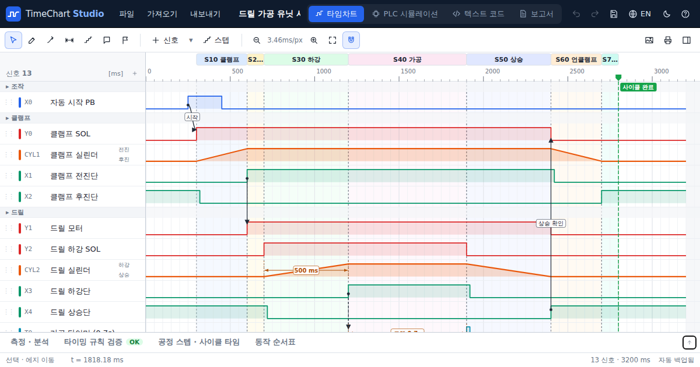

# TimeChart Studio

**제어 회로도를 그리면 타임차트와 부품 리스트가 자동으로 나오고, PLC 프로그램으로도 타임차트를 만들어 보고서(PDF)로 뽑는 무료 도구**입니다.
CADe SIMU 처럼 푸시버튼·릴레이·타이머·전자접촉기·전동기·공압 실린더로 결선도를 그리고 눌러서 움직여 볼 수 있습니다.

### ▶ 바로 쓰기: https://mioon1402.github.io/TimeChartForAutomation/

첫 주소는 무엇을 하는 도구인지 보여 주는 소개 페이지이고, **바로 시작하기**를 누르면 편집기(`…/TimeChartForAutomation/app/`)가 열립니다. 자주 쓰면 편집기 주소를 즐겨찾기하세요. 설치나 회원가입 없이 크롬·엣지에서 바로 열립니다. 인터넷이 막힌 PC에서는 [오프라인 파일(TimeChartStudio.html)](https://mioon1402.github.io/TimeChartForAutomation/TimeChartStudio.html)을 받아 더블클릭하세요.



- 여는 PLC 프로그램과 차트는 **서버로 보내지 않습니다.** 모든 계산은 각자의 브라우저 안에서만 합니다.
- 문제 신고와 기능 제안은 [Issues](https://github.com/mioon1402/TimeChartForAutomation/issues)에 남겨 주세요.
- [English summary](#english)

---

## 1. 한눈에 보기 (처음 보는 분을 위한 설명)

### 타임차트가 뭔가요?
설비가 한 사이클 동안 **언제 무엇이 켜지고 꺼지는지**를 시간 순서대로 그린 그림입니다.
가로축은 시간, 세로로는 신호(버튼, 솔레노이드, 센서, 모터…)가 한 줄씩 놓입니다.

```text
시간 →            0      0.5s     1.0s     1.5s     2.0s
시작 버튼   X0   _|‾‾|__________________________________
클램프 SOL  Y0   ____|‾‾‾‾‾‾‾‾‾‾‾‾‾‾‾‾‾‾‾‾‾‾‾‾‾|________
클램프 실린더    ____/‾‾‾‾‾‾‾‾‾‾‾‾‾‾‾‾‾‾‾‾‾‾‾‾‾‾\_______   ← 경사 = 움직이는 시간
전진단 센서 X1   _________|‾‾‾‾‾‾‾‾‾‾‾‾‾‾‾‾‾‾‾‾|________
                 [S10 클램프][S20 가공 ......][S30 언클램프]  ← 공정 스텝
```

설비 사양서, 매뉴얼, 사이클 타임 검토, 고객 보고서에 들어가는 그림이 바로 이것입니다.

### 이 프로그램이 해 주는 일
0. **회로도 → 타임차트 · 부품 리스트**: 회로도 탭에서 결선도(전원, 차단기, 푸시버튼, 릴레이·MC 코일과 접점, 타이머, THR, 램프, 전동기, 솔레노이드, 공압 실린더, PLC 블록)를 그리고 버튼을 눌러 시뮬레이션합니다. "PB1 누름 → 3초 뒤 PB0 누름" 같은 조작 순서만 적으면 회로가 그대로 움직인 결과가 타임차트가 되고, 그림에서 부품 리스트(기호·품명·사양·접점 수·수량)가 자동으로 나옵니다.
1. **그리기**: 마우스로 ON/OFF 파형을 그립니다. 실린더 이동 시간은 경사선으로, 공정 스텝은 색 띠로 표시하고, "이 신호 때문에 저 신호가 켜진다"는 화살표와 시간 치수선을 넣을 수 있습니다.
2. **PLC 프로그램으로 자동 생성**: PLC 프로그램(래더를 니모닉으로 뽑은 것)을 넣으면 PLC가 도는 것처럼 계산해서 타임차트를 자동으로 그려 줍니다. LS XG5000은 **니모닉(IL)을 PDF로 인쇄한 파일을 그대로 열면** 됩니다.
3. **검토와 보고서**: 사이클 타임과 가장 오래 걸리는 스텝(병목)을 계산하고, "SOL이 켜지고 0.4초 안에 센서가 들어와야 한다" 같은 규칙을 자동으로 OK/NG 판정합니다. 결과는 도면 표제란(작성/검토/승인)이 있는 PDF 보고서로 뽑습니다.

### 이렇게 흘러갑니다

```text
 ┌──────────────────┐   ┌───────────────────┐   ┌─────────────┐   ┌──────────────┐
 │ PLC 프로그램      │   │ 시뮬레이션          │   │ 타임차트      │   │ 보고서        │
 │ · XG5000 IL PDF  │ → │ · 스캔 계산         │ → │ · 마우스 수정 │ → │ · PDF 인쇄    │
 │ · GX Works CSV   │   │ · 실린더/센서 응답   │   │ · 규칙 검증   │   │ · PNG / 엑셀  │
 │ · 직접 그리기     │   │   자동 흉내         │   │ · 사이클 타임 │   │              │
 └──────────────────┘   └───────────────────┘   └─────────────┘   └──────────────┘
```

---

## 2. 실행하기 (어디서 여나요?)

두 가지 방법이 있고, 기능은 똑같습니다.

| 방법 | 이럴 때 | 여는 법 |
|---|---|---|
| **웹 주소** | 인터넷이 되는 PC, 태블릿, 휴대폰 | https://mioon1402.github.io/TimeChartForAutomation/ (소개 페이지) → 바로 시작하기, 또는 편집기 바로 가기 `…/TimeChartForAutomation/app/` |
| **오프라인 파일** | 공장 PC, 사내망처럼 인터넷이 막힌 곳 | 파일 1개(약 2.5MB)를 받아서 더블클릭 |

### 웹 주소로 열기
- 첫 주소는 **소개 페이지**입니다. 무엇을 할 수 있는지, 타임차트가 처음인 사람을 위한 설명, XG5000 PDF 로 만드는 법이 있고, 이 브라우저에 하던 작업이 있으면 **이어서 작업하기** 버튼이 나옵니다.
- 소개 페이지의 버튼은 편집기의 원하는 화면으로 바로 갑니다: `app/#circuit`(회로도 탭, 예제 회로), `app/#tutorial`(차트 그리기 튜토리얼), `app/#tutorial-plc`(PLC 튜토리얼), `app/#practice`(연습 문제), `app/#wizard`(동작 순서 탭), `app/#plc`(PLC 탭).
- 크롬 또는 엣지를 권장합니다. 편집기를 처음 열면 시작 화면에서 **회로도 그리기 / 예제 차트 둘러보기 / PLC 프로그램으로 만들기 / 동작 순서표로 만들기** 중 하나를 고릅니다.
- 휴대폰에서도 열리지만, 편집과 보고서 출력은 마우스가 있는 PC가 편합니다.
- 새 기능이 나오면 같은 주소에서 바로 반영됩니다.

### 오프라인 파일 받기
- 웹 주소에서 오른쪽 위 `?`(도움말) → **오프라인 버전 받기**를 누르거나, [TimeChartStudio.html](https://mioon1402.github.io/TimeChartForAutomation/TimeChartStudio.html)을 바로 받습니다.
- 저장소의 `release/TimeChartStudio.html`과 같은 파일입니다.
- 받은 파일을 **더블클릭**하면 기본 브라우저로 열립니다. 인터넷 연결이 필요 없고, USB나 사내 공유 폴더로 다른 PC에 복사해서 써도 됩니다.

### 내 파일은 안전한가요?
- 여는 PLC 프로그램이나 차트는 **어디로도 전송되지 않습니다.** 웹 주소로 열어도 파일을 읽고 계산하는 일은 모두 내 브라우저 안에서만 합니다.

### 작업 내용은 어디에 저장되나요?
- **자동 백업**: 고친 내용은 브라우저에 자동으로 보관돼서, 창을 닫았다 다시 열어도 이어서 할 수 있습니다. 다만 같은 PC, 같은 브라우저에서만 남아 있습니다.
- **파일로 저장**: `Ctrl+S`를 누르면 `.tchart` 파일로 저장됩니다. 다른 PC로 옮기거나 보관할 때는 이 파일을 쓰세요. `Ctrl+O`로 다시 엽니다. 설비 하나의 차트 여러 장(자동 사이클, 원점 복귀 …)도 한 파일에 함께 저장됩니다.

---

## 3. 5분 따라하기

> **앱 안에 따라 하기 튜토리얼이 있습니다.** 처음 열면 나오는 시작 화면, 또는 오른쪽 위 `?`(도움말)에서 **차트 그리기 기초** / **PLC 프로그램으로 차트 만들기**를 누르세요. 누를 버튼을 하나씩 짚어 주고, 해 보면 저절로 다음으로 넘어갑니다. 끝나면 원래 차트로 돌아옵니다.

직접 읽으며 해 보려면:

1. **예제 보기**: 처음 열면 나오는 시작 화면에서 `예제 차트 둘러보기`를 누르면 "드릴 가공 유닛" 예제 차트가 나옵니다. 상단 `파일 → 템플릿`에서 로봇 핸드셰이크, 인버터 컨베이어 예제도 열 수 있습니다.
2. **파형 고치기**: 왼쪽 위 연필(그리기, `D` 키)을 누르고 신호 줄에서 마우스로 끌면 ON/OFF가 뒤집힙니다. 화살표(선택, `V` 키) 상태에서 파형이 바뀌는 지점을 끌면 시간이 옮겨집니다. 틀리면 `Ctrl+Z`로 되돌립니다.
3. **PLC 프로그램으로 만들기**: 상단 `PLC 시뮬레이션` 탭 → `예제 불러오기…`에서 "LS XGK - 픽앤플레이스"를 고르고 → 오른쪽 아래 `▶ 시뮬레이션 → 타임차트 생성`을 누릅니다.
4. **보고서 뽑기**: `보고서` 탭 → `인쇄 / PDF 저장`을 누르고 → 프린터를 "PDF로 저장"으로 고릅니다.

### 실물 배선도로 그리기 (차단기 · 전자접촉기 · 버튼 · 전동기를 실제 모양으로)

회로도 탭 왼쪽 위의 **[실물 배선]**을 고르면, 기호 대신 실제 기기 모양과 단자 번호로 배선합니다(실체 배선도). **[회로 기호]**를 고르면 시퀀스도 기호로 돌아갑니다. 둘을 한 회로에 섞어도 똑같이 시뮬레이션됩니다.

- 기기: 전원 단자(L1 L2 L3 N PE, +24V 0V), 차단기 1P·2P·3P(레버를 누르면 ON/OFF), 전자접촉기(A1·A2 코일, 1/L1 3/L2 5/L3 → 2/T1 4/T2 6/T3, 보조 13-14 NO · 21-22 NC), 열동형 과부하 계전기(95-96 · 97-98, 눌러서 트립/복귀), 푸시버튼 유닛(버섯 머리, 11-12 b · 23-24 a), 셀렉터 스위치(손잡이 0 · 1, 11-12 b · 23-24 a), 비상정지(노란 판 + 빨간 버섯, 누르면 잠기고 다시 누르면 풀림), 파일럿 램프(X1 · X2), 3상 전동기(U V W + PE, 돌면 팬이 회전)
- **8핀 릴레이 + 소켓** (MK2P 꼴): 2-7 코일, 1-3 a · 1-4 b, 8-6 a · 8-5 b. 덮개에 내부 결선도가 그려져 있고, 동작하면 접점 날이 a 쪽으로 넘어갑니다
- **8핀 타이머 + 소켓**: 2-7 전원, 8-6 한시 a · 8-5 한시 b, 1-3 · 1-4 는 한시(기본) 또는 순시(속성에서 체크). 다이얼에 설정 시간이 보이고, 시뮬레이션 중에는 지난 시간이 다이얼에 차오릅니다. ON 딜레이 · OFF 딜레이 · 플리커
- 소켓 단자 번호는 위 1 2 3 4, 아래 8 7 6 5 로 그렸습니다. 소켓마다 번호 배치가 다를 수 있으니 실제로는 **소켓에 찍힌 번호**를 보고 같은 번호에 물리세요
- **단자대**: 번호마다 위·아래 나사가 이어져 있습니다. 극수는 속성에서 1~40 으로 바꿉니다. 판넬 안 기기는 아래 나사, 문(도어)에 붙는 버튼·램프는 위 나사로 이으면 실제 제어반처럼 됩니다
- 전선 색: 단자에서 끌어 선을 그으면 전원 극을 따라가 표준 색이 자동으로 붙습니다(L1 갈색, L2 검정, L3 회색, N 파랑, PE 녹황, +24V 빨강). 선을 고르면 오른쪽에서 색을 바꿀 수 있습니다.
- 시뮬레이션 중 전압이 닿은 전선 위로 흰 점선이 흐르고, 전자접촉기 창이 들어가며 램프가 켜지고 전동기 팬이 돕니다. L 이 PE 에 닿으면 지락(단락)으로 알려 줍니다.
- 예제: `예제 회로 → 실물 배선도: 전동기 기동·정지` (차단기 3P·2P, 전자접촉기 자기유지, 정지·기동 버튼, 전동기 PE 접지)
- 예제: `예제 회로 → 제어반 실물 배선: 릴레이 · 타이머 · 단자대` (문: 비상정지 · 셀렉터 · 정지/기동 버튼 · 정지/운전/대기 램프 ↔ 단자대 TB1 ↔ 판넬: 차단기 1P · 8핀 릴레이 X1 · 8핀 타이머 T1. 기동하면 대기 램프, 3초 뒤 운전 램프)

### 부품 쓰는 법이 궁금할 때

- 왼쪽 목록에서 부품을 누르면 오른쪽 **[속성]**에 **이 부품 쓰는 법**이 나옵니다: 무엇을 하는 기기인지, 단자마다 무슨 뜻인지, 어떤 순서로 잇는지, 시뮬레이션에서 어떻게 움직이는지. 그림에 놓인 부품을 눌러도 속성 아래에 같은 안내가 나옵니다.
- **[이 부품을 쓴 예제 열기]**를 누르면 그 부품이 실제로 배선된 예제가 새 차트 탭으로 열립니다 (지금 그리던 그림은 그대로).
- 단자 위에 마우스를 올리면 `MC1 13NO` 처럼 어느 기기의 몇 번 단자인지 뜹니다.
- 예: **전자접촉기**는 "전기로 누르는 큰 스위치"입니다. A1 · A2(코일)에 전압이 걸리면 주접점(1/L1→2/T1 …)과 보조접점(13-14 a, 21-22 b)이 함께 바뀝니다. 주회로는 차단기 → 1/L1 · 3/L2 · 5/L3, 2/T1 · 4/T2 · 6/T3 → 전동기. 코일은 A1 → N, A2 → 정지(b) → 기동(a) → L. 기동 버튼과 나란히 13-14 를 이으면 자기유지.
- 왼쪽 위 **[실물 배선 | 회로 기호]** 전환 버튼은 목록을 내려도 위에 붙어 있습니다.

### 타임 스위치로 전등 자동 점멸 (24시간 다이얼식)

`실물 배선 → 전등 · 타임 스위치`에 **24시간 타임 스위치**, **전등**, **스위치(단로)**, **3로 스위치**가 있습니다.

1. 전원 L · N → 차단기 2P
2. 차단기 아래 L → 타임 스위치 **L**, N → 타임 스위치 **N** (시계 전원: 늘 전압이 있어야 다이얼이 돕니다)
3. 타임 스위치 L 에서 **COM** 으로 점퍼선 하나
4. **NO** → 전등 L, 전등 N → N

- 켜지는 시간은 타임 스위치를 누르고 속성의 **켜지는 시간 (ON 구간)**에서 정합니다 (15분 단위, 여러 구간, `18:00 → 06:00` 처럼 자정을 넘겨도 됩니다). 다이얼 가장자리의 주황색 세그먼트가 켜지는 구간입니다.
- **[시뮬레이션]**을 누르면 1초에 1시간씩 흐르고(속도는 ×60 · ×600 · ×3600 중에서), 다이얼 바늘과 시각 표시가 돌다가 설정 시각에 전등이 켜지고 꺼집니다. 차단기를 내리면 시계가 멈춰서 그만큼 늦어집니다(정전 보상이 없는 기계식 기준).
- 타임차트는 하루(0~24시)가 시간 단위로 그려집니다. 시작 시각은 `조작 순서 → 시작 시각`에서 바꿉니다. 조작의 대기 시간은 `6h`, `30min` 처럼 적을 수 있습니다.
- 예제: `타임 스위치로 전등 자동 점멸 (기본)`, `타임 스위치 + 자동/수동 + 전자접촉기` (전등이 많을 때: 타임 스위치는 MC 코일만 켜고 셀렉터로 수동 점등), `3로 스위치 계단등`
- 타임 스위치는 제품마다 단자 이름과 배치가 다릅니다 (전원 2개 + 접점 COM · NO · NC 가 일반적). 실제로는 제품 옆면 결선도를 보고 같은 뜻의 단자에 물리세요.

### 결선표 (배선 목록) 보면서 배선하기

회로도 오른쪽 **[결선표]** 탭은 그림의 선을 실제 전선 한 가닥씩, `MCB1 2 → X1 8 (빨강)` 처럼 **단자 → 단자**로 풀어 씁니다. 그림에서 갈라지는 선은 한 나사에 두 가닥을 물리는 것으로 나눠 줍니다.

- 줄을 누르면 그림에서 그 전선이 주황색으로 강조되고 두 단자에 동그라미가 쳐집니다 (화면 밖이면 그쪽으로 이동)
- 배선을 마친 줄은 체크하세요. 체크는 차트 파일에 함께 저장되고, 위쪽 막대로 몇 가닥 남았는지 보입니다
- **선번호**: 같은 전위(같은 넷)는 같은 번호입니다. 단자대 위·아래도 같은 번호라 마크 튜브 번호로 쓰면 됩니다. 전원(L, N)부터 1, 2 … 순서입니다
- 실물 기기의 나사로 들어가는 전선 끝은 기기 그림 위에 다시 그려서, 어느 나사에 물리는지 보입니다
- **그림에 선번호 적기**를 켜면 전선마다 번호표가 그림에 붙습니다. 보고서의 회로도에도 결선표와 같은 번호가 찍힙니다
- **따라 배선하기**: 한 가닥씩 차례로 안내합니다. `완료 → 다음`을 누르면 체크되고 다음 전선으로 넘어가며, 마친 전선만 진하게 · 아직 안 한 전선은 흐리게 보여서 지금 어디까지 했는지 한눈에 보입니다
- 엑셀 CSV 로 저장할 수 있고, 보고서에 체크 칸(☐)과 함께 인쇄됩니다 (`보고서 → 결선표`)

### 회로도를 그려서 타임차트 · 부품 리스트 만들기 (회로도 탭)

맨 앞 `회로도` 탭이 이 프로그램의 시작점입니다. 결선도를 그리면 나머지(타임차트, 부품 리스트, 보고서)는 따라 나옵니다.

1. **예제로 익히기**: 회로도 탭 위쪽 `예제 회로`에서 **자기유지 / 정역 운전(인터록) / 타이머 지연 동작 / 공압 실린더 1사이클 / 전공압 자동 왕복(밸브·근접 센서) / PLC 자기유지 + 타이머** 중 하나를 엽니다. PLC 예제는 PLC 탭에 미쓰비시 프로그램이 함께 들어가고, 그 프로그램을 고치면 회로도 동작도 바뀝니다.
2. **부품 놓기**: 왼쪽 목록(전원, 보호 기기, 조작 스위치, 릴레이·타이머, 출력, 공압)에서 부품을 누르고 그림판을 누르면 놓입니다. `Shift`를 누른 채 놓으면 계속 놓을 수 있고, `R`은 회전, `Delete`는 삭제입니다.
3. **선 긋기**: 부품 단자(작은 점)에서 다른 단자까지 끌면 꺾인 선이 그어집니다. 선 중간에서 끌기 시작하거나 선 끝이 다른 선 중간에 닿으면 T 분기로 이어지고 점이 찍힙니다. 엇갈리기만 한 선은 이어지지 않습니다. 빈 곳에서 시작하려면 `W`(선 긋기 도구)를 쓰세요.
4. **기호로 연동**: 코일 `X1`과 접점 `X1`처럼 기호가 같으면 함께 움직입니다. 타이머 `T1`의 접점은 한시 접점, THR 의 b접점(95-96)은 트립되면 열립니다. 리밋 스위치는 속성에서 실린더 끝(전진단/후진단)에 연결합니다.
5. **시뮬레이션**: `▶ 시뮬레이션`을 누르고 버튼을 마우스로 누릅니다(누르는 동안 ON). 셀렉터·차단기·THR·비상정지는 누를 때마다 바뀝니다. 전압이 닿은 선은 극마다 색(L·+24V 빨강, N·0V 파랑, L2 주황, L3 보라)으로 보이고, 코일·램프·전동기 회전(정/역)·실린더 움직임이 그대로 보입니다. 단락, 3상 결상도 알려 줍니다. 속도는 ×0.25 ~ ×4, 일시정지가 됩니다.
6. **조작 순서 → 타임차트**: 오른쪽 `조작 순서`에 "대기 0.5 s → PB1 누름(0.3 s) → 대기 3 s → PB0 누름"처럼 적으면 아래 미리보기에 타임차트가 바로 그려지고 `타임차트` 탭에 반영됩니다. 시뮬레이션에서 직접 눌러 본 뒤 `정지`하면 누른 순서와 시간을 조작 순서로 저장할 수도 있습니다. 메모를 적으면 차트의 공정 스텝 이름이 되고, 타이머 지연은 치수선으로 자동 표시됩니다.
7. **부품 리스트**: `부품 리스트`에 기호마다 품명·설명·사양·접점 수(예: 전자접촉기 주접점 3P, 보조 2a1b)가 나오고, 같은 품명·사양끼리 수량을 모은 표가 함께 나옵니다. `엑셀 CSV 저장`으로 받거나 보고서에 넣어 인쇄합니다.
8. **검사**: 코일이 없는 접점, 같은 기호의 코일 두 개, 이어지지 않은 단자, 전원 없음 같은 실수를 `검사`에서 알려 줍니다.

> 차트가 손으로 그린 것이면 회로를 고쳐도 덮어쓰지 않습니다. 이때는 `타임차트에 적용`을 눌러야 바뀝니다. 같은 기호의 신호는 이름·색·화살표를 유지하고 파형만 바뀝니다. 새 회로는 `+ 차트 추가 → 회로도로 새 차트`로 시작하세요.

### 내 설비의 타임차트를 처음부터 만들기 (동작 순서 탭)

실무에서 타임차트는 파형부터 그리지 않습니다. 설계 순서가 있고, 타임차트는 그 결과물입니다.

| 순서 | 하는 일 | 왜 필요한가 |
|---|---|---|
| ① 설비 사양 | 어떤 설비인지, 한 사이클을 몇 초 안에 끝내야 하는지(목표 사이클 타임, 택트 타임) 정합니다. | 목표가 있어야 나중에 "시간 안에 들어오는가"를 판단합니다. |
| ② 동작 기기 | 움직이는 것(실린더, 모터, 흡착·척)을 적고, 한쪽 끝에서 반대쪽 끝까지 걸리는 **동작 시간**을 적습니다. | 차트의 막대 길이와 경사선이 이 시간입니다. 모르면 0.5초로 두고 시운전 뒤 실측값으로 고칩니다. |
| ③ I/O 목록 | 기기마다 PLC 가 켜는 **출력**(솔레노이드 SOL, 모터)과 PLC 가 읽는 **입력**(시작 버튼, 끝 위치 센서)을 정하고 주소(X0, Y0 / P00000 / I0.0)를 붙입니다. | 제어 설계(PLC 프로그램, 배선도)와 같은 이름·주소를 쓰기 위해서입니다. |
| ④ 동작 순서 | 한 사이클 동안 무엇이 먼저 움직이고, 무엇이 동시에 움직여도 되는지 정합니다. 보통은 앞 동작이 끝났다는 센서를 확인한 뒤 다음 동작을 시작합니다. | 동시에 움직여도 부딪히지 않는 동작을 겹치면 사이클 타임이 줄어듭니다. 마지막에는 모든 기기가 원위치로 돌아와야 다음 사이클을 시작합니다. |
| ⑤ 타임차트 · 검토 | 위 내용으로 차트를 그리고, 목표 사이클 타임 안에 들어오는지, 동시에 켜지면 안 되는 출력(전진 SOL 과 후진 SOL)이 겹치지 않는지 확인한 뒤 작성·검토·승인합니다. | 이 차트가 PLC 프로그램 작성과 시운전의 기준이 됩니다. |

위쪽 **동작 순서** 탭이 이 순서를 한 페이지에 위에서 아래로 그대로 놓았습니다. 처음 열면 **예시로 시작하기**(클램프 → 프레스) 또는 **빈 표로 시작하기**를 고릅니다(`파일 → 새 차트: 동작 순서표로 만들기`와 같음).

1. **① 설비**: 설비 이름, 차트 제목, 도면 번호, 작성자, 목표 사이클 타임(초). 이 칸은 차트 제목과 보고서 표제란에 바로 들어갑니다.
2. **② 동작 기기**: 이름, 종류, 가는·돌아오는 동작 이름, 가는·돌아오는 시간(초), 끝 센서 유무를 표에 적습니다. 종류는 네 가지입니다.
   - 실린더 (더블 SOL): 전진 SOL 과 후진 SOL 두 개. 신호를 끊어도 그 자리에 머뭅니다. 차트에는 움직이는 동안만 SOL 이 켜집니다.
   - 실린더 (싱글 SOL): SOL 하나. 켜 두는 동안 전진해 있고, 끄면 스프링으로 돌아옵니다.
   - 모터: 운전 출력 하나. 기동부터 정지까지 켜져 있습니다.
   - 흡착 · 척: SOL 하나와 흡착(잡힘) 확인 센서.
3. **③ I/O 목록**: 기기에서 입력·출력을 자동으로 뽑아 번호를 매깁니다. 주소 방식(미쓰비시 8진수 X0·Y0 / LS P00000·P00040 / 지멘스 I0.0·Q0.0 / 주소 없이)을 고르고, 실제 배선과 다른 주소나 이름만 고칩니다. `PLC 탭 코멘트로 보내기`를 누르면 이 이름들이 PLC 탭의 디바이스 코멘트에 들어가서, 나중에 PLC 프로그램을 시뮬레이션할 때 같은 이름으로 보입니다.
4. **④ 동작 순서**: 한 줄에 기기와 동작 하나(예: 클램프 · 전진). 시작 칸은 **앞 동작이 끝난 뒤** 또는 **앞 동작과 동시에**. 끝에 `+0.2`처럼 초를 붙이면 그만큼 늦게 시작합니다(센서 확인 후 안정화 0.2초, 실린더가 출발하고 0.3초 뒤 블로우 등). 가공·가압처럼 기다리기만 할 때는 기기 칸에 `대기`, 동작 칸에 무엇을 기다리는지(가공)를 적습니다. 오른쪽 **시간 흐름** 막대가 바로 바뀝니다. 이미 그 위치인 기기를 또 움직이거나, 사이클이 끝났는데 원위치로 돌아오지 않은 기기가 있으면 "검토할 점"으로 알려 줍니다.
5. **⑤ 확인**: 예상 사이클 타임, 목표 대비 OK/NG 와 여유, 가장 긴 스텝, **실제 차트 미리보기**가 표를 고칠 때마다 바뀝니다. 괜찮으면 **차트에 적용**을 누릅니다.

**표는 엑셀처럼 씁니다**

| 조작 | 하는 일 |
|---|---|
| 칸을 누르고 바로 입력 | 그 칸 값을 바꿈 (한글 입력 그대로) |
| Enter / Tab / 방향키 | 아래 / 오른쪽 / 그 방향 칸으로 이동 |
| F2, 두 번 클릭 | 지금 값을 고치기 |
| 마지막 빈 줄에 입력 | 줄이 늘어남 |
| Ctrl+C / Ctrl+V | 엑셀·구글 시트와 여러 칸 복사·붙여넣기, 한 칸 값을 여러 칸에 붙이면 모두 채움 |
| 마우스로 끌기, Shift+방향키 | 범위 선택 |
| 줄 번호 누르고 Delete, Ctrl+- | 줄 삭제 |
| Alt+↑ / Alt+↓, Ctrl+D | 줄 위아래로 옮기기, 줄 복제 |
| Ctrl+Z / Ctrl+Y | 되돌리기 / 다시 하기 |

- ④ 에 ② 에 없는 기기 이름을 적으면 기기가 자동으로 생깁니다(더블 SOL 실린더). 처음 적은 동작 이름(예: `하강`)이 그 기기의 가는 동작이 되고 반대 동작(`상승`)도 채워집니다. 같은 기기 이름만 한 번 더 적으면 반대 동작이 됩니다.
- **엑셀 동작 순서표 붙여넣기**: 엑셀에서 표를 복사해 ④ 의 첫 칸을 누르고 `Ctrl+V` 하거나, `엑셀 표 붙여넣기…` 버튼을 누릅니다. 첫 줄이 제목(`기기`, `동작`, `시간`, `시작` 같은 말이 들어간 칸)이면 제목으로 칸을 맞추고, `시간(ms)` 처럼 ms 라고 적힌 칸은 ms 로 읽습니다. 제목 줄이 없으면 기기 · 동작 · 시간 · 시작 순서로 읽고, 맨 앞 칸이 순서 번호(1, 2, S10 …)면 건너뜁니다. `클램프 전진`, `가공 대기`처럼 한 칸에 적어도 나눠서 읽습니다.
- **엑셀 I/O 리스트 붙여넣기**: ③ 표에 제목 줄(`주소`, `이름`/`코멘트`)과 함께 붙여 넣으면 이름이 같은 I/O 를 찾아 주소를 넣습니다. 제목 줄 없이 붙이면 누른 칸부터 차례로 들어갑니다.
- `엑셀로 복사` 버튼은 기기 표, I/O 목록, 동작 순서표를 엑셀에 바로 붙일 수 있게 복사합니다.

고친 내용은 바로 파일에 들어가고(자동 백업, `Ctrl+Z` 가능), **차트는 `차트에 적용`을 눌렀을 때만 다시 만듭니다.** 적용하지 않은 변경이 있으면 위쪽 `동작 순서` 탭에 주황 점이 붙습니다. 적용한 뒤 차트에서 파형·화살표·주석을 손으로 고쳤다면 다시 적용하기 전에 한 번 묻습니다(적용한 뒤에도 `Ctrl+Z`로 되돌릴 수 있음). 표제란(제목·회사·검토·승인), 보고서 설정, PLC 설정은 다시 적용해도 그대로입니다.

만들어지는 차트에는 이런 것이 들어갑니다.
- 기기별 그룹: 출력(SOL, 모터) 파형, 실린더 동작선(경사 = 동작 시간), 끝 위치 센서 파형(원위치 센서는 떠나는 순간 꺼지고 돌아오면 켜짐)
- 대기 타이머 행, 공정 스텝 띠(S10, S20 …), "센서 확인 → 다음 동작" 화살표, 사이클 완료 표시
- 검토 규칙: 목표 사이클 타임, 더블 SOL 실린더마다 "전진/후진 SOL 동시 ON 금지". 결과는 아래 `타이밍 규칙 검증` 탭과 보고서에 나옵니다.
- 보고서에는 **동작 순서표(설계)**가 따로 실립니다: 스텝, 기기, 동작, 시간, 시작 조건, 시각, 출력 주소(예: `Y0 ON`), 완료 확인 센서(예: `X1`).

### 설비 하나를 파일 하나로 (차트 여러 장)

한 설비에는 보통 자동 운전 사이클, 원점 복귀, 유닛별 동작처럼 차트가 여러 장 있습니다. 위쪽 **차트 탭**(엑셀의 시트처럼)에서 한 파일에 모아 관리합니다.

- `+ 차트 추가`: 동작 순서표로 새 차트 / 빈 차트 / 지금 차트 복제 / 템플릿. 새 차트는 회사·설비·도면 번호·작성·검토·승인을 그대로 이어 받습니다.
- 탭을 누르면 그 차트로, 두 번 누르면 이름 바꾸기(자동으로 붙은 제목이면 제목도 함께 바뀜). `▾` 메뉴로 복제, 왼쪽/오른쪽으로 옮기기, 삭제. `Ctrl+PgUp` / `Ctrl+PgDn`으로 넘깁니다.
- 차트마다 동작 순서표, PLC 설정, 표제란, 실행 취소 기록이 따로 있습니다.
- 왼쪽 폴더 아이콘 옆 이름이 **설비 이름**이고, 저장할 때 파일 이름이 됩니다.
- 차트가 한 장뿐이면 예전과 똑같은 형식으로 저장되어 이전 버전에서도 열립니다.

### 인쇄: 한 장 · 세로 · 흑백

`보고서` 탭(또는 `Ctrl+P`)에서 고릅니다.

- **출력 방식 → 한 장으로**: 제목, 사이클 타임·목표·규칙 결과, **전체 타임차트**, 공정 스텝 표를 한 장에 맞춰 넣습니다. 차트는 행 높이를 늘리거나 줄여 페이지에 맞추므로 글자가 작아지지 않습니다. 설비 옆에 붙여 두거나 회의 자료로 쓰기 좋습니다.
- **출력 방식 → 여러 장 보고서**: 표지·요약, 타임차트, 동작 순서표(설계), 신호(I/O) 목록, 공정 스텝, 입출력 변화 순서, 규칙 검증, 인터록·주석을 싣습니다. 짧은 표는 한 장에 모으고, 긴 표는 제목 줄을 되풀이하며 다음 장으로 잇습니다.
- **용지 · 방향**: A4/A3, 가로/세로. 세로 용지에서는 차트 행을 높여 빈 곳을 채우고, 표제란 칸 폭도 세로에 맞춥니다.
- **흑백 프린터용**: 선은 검정으로 굵게, ON 구간은 색 대신 무늬로 구분합니다(출력 = 진한 칠, 입력·센서 = 빗금, 실린더 동작·타이머 = 옅은 칠). 차트 아래에 범례가 붙습니다.
- **인쇄 범위 → 설비 전체**: 차트가 여러 장이면 맨 앞에 목차(차트, 제목, 사이클 타임, 스텝 수, 규칙 결과, 페이지)를 붙이고 모든 차트를 차례로 싣습니다. "한 장으로"와 함께 쓰면 차트마다 한 장씩입니다.
- 인쇄 창의 배율은 기본값(100%)으로 두세요. 용지와 방향은 여기서 고른 대로 맞춰집니다. PDF 로 남기려면 프린터를 "PDF로 저장"으로 고릅니다.

### 연습 문제: 직접 그려 보고 채점받기

타임차트는 읽을 줄 아는 것과 직접 그릴 줄 아는 것이 다릅니다. `배우기 → 연습 문제` (또는 시작 화면, 도움말 `?`)에서 문제를 골라 직접 그려 보고 채점받을 수 있습니다.

**푸는 방법**
1. 문제를 고르면 차트가 연습용으로 바뀝니다. 위쪽 **① 주어진 입력**(버튼을 누른 시각 등)은 그대로 두고, 아래쪽 **② 그려야 할 신호**를 그립니다.
2. 아래 **연습 문제** 칸에 문제, 배우는 것, 주어진 조건, 그릴 것이 적혀 있습니다. PLC 문제에는 래더 그림과 니모닉(미쓰비시)이 함께 나옵니다.
3. 연필(그리기) 도구로 그립니다. `Shift` 를 누르고 끌면 ON, `Alt` 를 누르고 끌면 OFF 로 칠해집니다. 눈금(0.1초)에 자동으로 붙습니다.
4. **채점하기**를 누르면 신호마다 맞았는지 알려 줍니다. 틀렸으면 "2초에 OFF 되어야 하는데 2.5초에 OFF 되었습니다", "ON 구간이 2번 있어야 하는데 1번 그렸습니다", "시작할 때(0초) ON 이어야 합니다"처럼 어디가 다른지 구체적으로 알려 줍니다. 시각은 눈금 한 칸(0.1초) 안이면 맞은 것으로 봅니다.
5. 막히면 **힌트**를 하나씩 열어 봅니다(문제마다 2~3개). **정답 보기**로 정답 차트를 보고 **내 답 보기**로 돌아올 수 있습니다. **해설**에는 몇 초에 무엇이 왜 일어나는지 단계별 설명과 실무 메모가 있습니다.
6. 맞힌 문제는 문제 목록에 ✓ 와 점수가 남습니다(이 브라우저에만 저장). **연습 끝내기**를 누르면 연습 전 차트로 돌아옵니다.

**PLC 읽기: 프로그램을 보고 출력 파형 그리기** (정답은 내장 PLC 시뮬레이터로 계산)

| 번호 | 난이도 | 문제 | 배우는 것 |
|---|---|---|---|
| 1 | 기초 | 자기유지 회로 | 버튼을 떼도 출력이 유지되는 자기유지, 정지 버튼을 B접점으로 쓰는 이유 |
| 2 | 기초 | ON 딜레이 타이머 | 입력이 계속 켜져 있는 동안만 시간을 세고, 꺼지면 처음부터 다시 센다 |
| 3 | 중급 | 버튼 한 개로 켜고 끄기 | PLS(상승 펄스)는 누른 순간 한 스캔만 켜진다, 누를 때마다 바뀌는 토글 |
| 4 | 중급 | 정·역회전 인터록 | 동시에 켜지면 안 되는 두 출력을 서로의 B접점으로 막기 |
| 5 | 중급 | 카운터: 3개 모이면 알림 | 켜질 때마다 하나씩 세기, 설정값 도달, 리셋, 스캔 순서에 따른 한 스캔 지연 |
| 6 | 중급 | 깜빡이(플리커) 회로 | 타이머 두 개가 서로 리셋하며 일정 주기의 ON/OFF 만들기 |
| 7 | 응용 | 순차 기동 (1초 간격) | 타이머를 이어 여러 출력을 차례로 켜기, 공통 정지로 한꺼번에 끄기 |
| 8 | 응용 | 컨베이어 정지 지연 | 입력이 꺼진 뒤 일정 시간 뒤에 끄는 OFF 딜레이를 ON 딜레이로 만들기 |
| 9 | 응용 | 실린더 동작 시간 초과 알람 | 정해진 시간 안에 끝단 센서가 안 오면 알람(자기유지)을 내고 SOL 을 끊는 타임아웃 감시 |

**설비 동작: 설명을 보고 솔레노이드 · 센서 파형 그리기** (정답은 동작 순서 탭과 같은 계산)

| 번호 | 난이도 | 문제 | 배우는 것 |
|---|---|---|---|
| 1 | 기초 | 실린더 한 개 왕복 | 출력 ON → 출발(출발한 쪽 센서 OFF) → 도착(도착한 쪽 센서 ON) → 다음 동작의 순서 |
| 2 | 기초 | 싱글 솔레노이드 스토퍼 | 싱글 SOL 은 켜 두는 동안만 그 위치, 대기 타이머 표시 |
| 3 | 중급 | 클램프 → 프레스 → 가압 | 앞 동작의 도착 센서가 다음 동작을 시작시키는 흐름, 사이클 타임 계산 |
| 4 | 중급 | 두 클램프 동시 동작 | 동시 동작은 늦게 도착하는 쪽을 기다린다, 동시 동작으로 사이클 타임 줄이기 |
| 5 | 응용 | 픽앤플레이스 | 흡착 확인 센서가 있는 8단계 이송 동작을 시간표로 풀어 그리기 |
| 6 | 응용 | 드릴 가공 (모터 포함) | 센서 없는 모터 출력과 실린더를 함께, 동시 동작이 섞인 순서 |

문제는 `src/learn/exercises.ts` 에 모여 있어서 같은 형식으로 계속 늘릴 수 있습니다. 설비 문제는 동작 순서 입력(기기, 동작 순서)만 적으면 정답 차트와 시간표 해설이 자동으로 만들어지고, PLC 문제는 프로그램과 입력 파형만 적으면 정답이 시뮬레이터로 계산됩니다.

---

## 4. LS XG5000 사용자: 니모닉(IL) PDF로 차트 만들기

XG5000은 니모닉을 텍스트나 CSV로 내보내는 기능이 없고 **인쇄(PDF)** 만 됩니다. 이 프로그램은 그 PDF를 그대로 읽습니다.

1. XG5000에서 프로그램을 열고 **니모닉(IL) 보기** 상태에서 인쇄합니다.
2. 프린터를 **"Microsoft Print to PDF"** 로 골라 PDF로 저장합니다.
3. TimeChart Studio → `PLC 시뮬레이션` 탭 → **`파일 열기 (PDF 가능)`** → 저장한 PDF를 고릅니다. PDF 파일을 창에 끌어다 놓아도 됩니다.
   - 페이지 머리말, 표 제목, 렁 설명문, 페이지 번호는 자동으로 걸러내고 명령어와 오퍼랜드만 읽습니다.
   - 줄 끝의 설명문(예: `LOAD P00000 시작 버튼`)은 신호 이름으로 씁니다.
   - 가운데 칸 위에 "명령 N개, 디바이스 M개"가 나오고, 읽지 못한 명령이 있으면 줄 번호와 함께 표시합니다.
4. **입력 자극**: 시작 버튼 같은 입력에 "펄스"를 고르고 시간(예: `100-300`, 단위 ms)을 넣습니다. `자동 설정` 버튼을 누르면 "시작"이라는 이름이 붙은 입력에 자동으로 넣어 줍니다.
5. **설비 모델**: `+ 실린더`를 눌러 "전진 출력 = P00040, 전진단 센서 = P00001, 후진단 센서 = P00002, 전진 시간 0.4s"처럼 적습니다. 그러면 솔레노이드가 켜진 뒤 그 시간이 지나 센서가 알아서 켜지므로, 사이클이 끝까지 진행됩니다.
   - 크레인 주행·횡행·권상, 컨베이어처럼 **위치가 움직이는 축**은 `+ 위치 축`을 씁니다. 정/역 출력, 속도(단위/초), 속도 선택 출력(저속·고속), 엔코더 카운터(예: C0251), 리밋 스위치의 위치 구간(예: UP.END = 0~9900 에서 ON)을 적으면, 출력이 켜진 동안 위치가 움직이고 엔코더 값과 리밋 스위치가 저절로 바뀝니다. 차트에는 위치가 경사선(아날로그)으로 그려집니다.
6. **타이머 단위**: XGK 기본 파라미터의 타이머 단위(보통 100ms)와 `타이머 기본 단위`를 맞춥니다. `TON T0000 5` → 100ms × 5 = 0.5초입니다.
7. `▶ 시뮬레이션 → 타임차트 생성`을 누릅니다.

### 실제 I/O가 M 릴레이로 매핑된 프로그램 (공정이 안 보일 때)

많은 프로그램이 앞부분에서 `LOAD P00019 → OUT M0062C`처럼 **실제 입력(P)을 M 릴레이로 옮겨 놓고**, 나머지 로직은 전부 M 으로만 짭니다. 출력도 `LOAD M00004 → OUT P00021`처럼 M 을 거쳐 내보냅니다. 그러면 로직만 봐서는 "어느 버튼, 어느 모터인지" 알기 어렵습니다. 이 프로그램은 이 매핑을 **자동으로 추적**합니다.

- **자동 추적**: 단순 복사 렁(`LOAD P → OUT M`), 반전 복사(`LOAD NOT P`), 항상 ON 조건을 거친 복사(예: `AND A크레인선택`, F00099)와 여러 단계 사슬(P00019 → M0062C → M00440)을 끝까지 따라가 원본 I/O 를 찾습니다. 자기유지나 실제 조건이 붙은 렁은 매핑으로 보지 않습니다.
- **디바이스 목록**: `M00440  = P00019 UP`, `M00004  → P00021`처럼 옆에 실제 I/O 가 표시됩니다. 설명이 없는 M 은 원본 I/O 의 설명을 물려받습니다. 검색 칸에 `P00019`를 치면 그 입력을 받아 쓰는 M 릴레이까지 찾아집니다.
- **I/O 매핑표**: 디바이스 목록 아래 `I/O 매핑표`를 펼치면 "실제 I/O ↔ 프로그램에서 쓰는 M 릴레이" 표가 나옵니다.
- **실제 I/O로 바꾸기**: 차트 행 순서 옆 버튼을 누르면, 표시 목록의 매핑 릴레이를 실제 입출력(P)으로 바꿔 줍니다. `자동 설정`도 매핑 릴레이 대신 실제 I/O 를 고릅니다.
- **공정이 보이게**: `공정 스텝 디바이스`를 **"출력 조합으로 자동"** 으로 두면, "지금 어떤 출력이 켜져 있나"가 바뀔 때마다 공정 스텝을 나눕니다 (예: `UP → UP + 저속 → LEFT → BACK우 → 대기 → DOWN`). 전원 MC처럼 거의 항상 켜진 출력, 램프·부저, 깜빡이는 출력은 빼고, 설비 모델의 동작 출력 이름을 먼저 씁니다. 스텝 레지스터가 없는 LS 프로그램은 이것이 기본값입니다.
- **동작 순서표**: 차트 아래 `동작 순서표` 탭에 "몇 초에 무엇이 켜지고 꺼졌는지"가 시간 순으로 나오고(직전 변화와의 간격, 속한 공정 스텝 포함), 행을 누르면 그 시각으로 이동합니다. 보고서에도 같은 표가 들어갑니다.

알아 두세요
- 글자를 고를 수 없는 **스캔(이미지) PDF**는 읽지 못합니다. 반드시 XG5000에서 직접 PDF로 인쇄하세요.
- PDF에서 복사한 텍스트를 편집 칸에 붙여넣어도 됩니다. 칸이 한 줄씩 쪼개져 붙어도 읽습니다.
- 디바이스 설명문(변수/설명문 목록)도 PDF로 인쇄해서 `디바이스 코멘트 → CSV / PDF`로 열 수 있습니다.
- 지원: **XGK / XGB** 니모닉(LOAD, AND NOT, OR LOAD, MPUSH, OUT, SET/RST, TON/TOFF/TMR, CTU/CTD, MOV/INC/ADD, 비교 LOAD= 등). **XGI/XGR**의 IEC식 IL(LD, ST …)은 아직 지원하지 않습니다.

## 5. 다른 PLC

| PLC | 준비 방법 |
|---|---|
| 미쓰비시 GX Works2/3 | 프로젝트 → 다른 형식으로 저장(내보내기) → CSV. 니모닉을 복사해 붙여넣어도 됩니다. |
| 지멘스 STEP7 / TIA | STL(AWL) 소스를 붙여넣거나 `.awl` 파일로 엽니다. 영문(A, AN) 니모닉과 독일어(U, UN) 니모닉을 모두 읽습니다. |
| CODESYS · TwinCAT · SCL · XG5000 ST · GX Works3 ST | ST 코드를 붙여넣습니다. `CASE Step OF` 스텝 번호와 `10: (* 클램프 *)` 주석이 공정 스텝 이름이 됩니다. |

---

## 6. 무엇을 그릴 수 있나요?

| 그릴 수 있는 것 | 방법 |
|---|---|
| ON/OFF 신호 (버튼, 센서, 솔레노이드, 릴레이, 타이머) | 비트 신호 |
| 실린더·모터 동작 (이동 시간만큼 경사선, 전진/후진·상승/하강 글자) | 비트 신호 + 동작 시간 + ON/OFF 라벨 |
| 스텝 번호, 지령값, 상태 코드 | 워드(데이터) 신호: 값이 바뀌는 구간마다 육각형 칸 |
| 속도, 압력 같은 연속 값 (가감속 경사) | 아날로그 신호 |
| 크레인·컨베이어 위치, 엔코더 값 | 위치 축 설비 모델 → 아날로그 위치선 (엔코더 워드도 자동으로 선 그래프) |
| 클럭 | 클럭 신호 (주기, 듀티) |
| 공정 스텝 구간 | 차트 위 색 띠 + 세로 점선 |
| 원인 → 결과 화살표, 시간 치수선, 메모, 세로 마커 | 도구 모음 |
| 그룹 (클램프부, 드릴부 …), 행 높이, 색 | 속성 패널 |

아직 못 하는 것 (필요하면 추가할 수 있습니다)
- 가로축을 **시간 대신 스텝 번호(1, 2, 3 …)로 나누는** 엑셀 칸 형식의 차트
- 3위치 실린더처럼 **세 위치를 오가는 동작선** (위치 축 모델의 아날로그 위치선으로 대신 그릴 수 있습니다)
- 차트 아무 곳에나 자유롭게 도형을 그리는 기능

---

## 7. 용어 풀이

| 용어 | 뜻 |
|---|---|
| 니모닉 / IL | 래더를 글자 명령으로 풀어 쓴 것. `LOAD P00000`, `OUT P00040` 같은 형태 |
| 스캔 / 스캔 타임 | PLC가 프로그램을 처음부터 끝까지 한 번 실행하는 것과 그 시간(예: 10ms) |
| 입력 자극 | 시뮬레이션에서 사람이 누르는 버튼처럼 밖에서 넣어 주는 입력 |
| 설비 모델 | "SOL이 켜지면 0.4초 뒤 전진단 센서가 켜진다"는 설비의 반응을 흉내 내는 설정 |
| 공정 스텝 | 설비 동작을 나눈 단계 (클램프 → 가공 → 언클램프) |
| 매핑 릴레이 | 실제 입출력(P)을 그대로 옮겨 담아 프로그램 안에서 대신 쓰는 M 릴레이 |
| 동작 순서표 | 신호가 켜지고 꺼진 순서를 시간 순으로 적은 표 |
| 인터록 | 동시에 켜지면 안 되는 신호의 관계 (예: 전진 SOL과 후진 SOL) |
| 사이클 타임 | 한 사이클을 도는 데 걸리는 시간 |
| 표제란 | 도면 오른쪽 아래의 제목·도면번호·작성/검토/승인 칸 |

## 8. 자주 묻는 질문

- **인터넷이 없어도 되나요?** 오프라인 파일로 받으면 됩니다. 파일 하나에 모든 기능이 들어 있습니다.
- **무료인가요? 회원가입이 필요한가요?** 무료이고, 가입이나 로그인 없이 씁니다.
- **회사 PLC 프로그램이 외부로 나가지 않나요?** 나가지 않습니다. 파일을 여는 것도, 계산도 모두 내 PC 브라우저 안에서만 합니다.
- **엑셀로 옮길 수 있나요?** `내보내기 → 엑셀 CSV`(변화 시점표, 신호 목록, 스텝표)를 쓰거나, `이미지 복사` 후 엑셀·파워포인트·한글에 붙여넣으세요.
- **시뮬레이션 결과를 그대로 믿어도 되나요?** 설계 검토용입니다. 실제 설비의 응답 시간은 설비 모델에 넣은 값에 따라 달라집니다. 실측 로그(CSV)를 가져와 비교할 수 있습니다.
- **맥이나 태블릿, 휴대폰에서도 되나요?** 크롬·엣지에서 확인했습니다. 맥에서도 크롬으로 열면 됩니다. 휴대폰은 보기와 간단한 수정용이고, 편집은 마우스가 있는 PC가 편합니다.
- **안 되는 게 있거나 원하는 기능이 있어요.** [Issues](https://github.com/mioon1402/TimeChartForAutomation/issues)에 남겨 주세요. 가능하면 PLC 종류와 화면 캡처를 함께 적어 주세요. 회사 프로그램 원본은 올리지 마세요.

---

## 9. 기능 상세

### 회로도 시뮬레이션
- 부품: 전원(L·N, +24V·0V, 3상 L1·L2·L3, SMPS AC→DC 24V), 배선용 차단기 1P·3P, 퓨즈 1P·3P, 열동형 과부하 계전기(THR, 트립/복귀), 푸시버튼 a·b(색), 셀렉터 a·b, 비상정지, 리밋 스위치 a·b, 리드·플로트·압력 스위치, 근접 센서(유도형·정전용량형)·광전 센서(3선식 PNP/NPN), 릴레이·전자접촉기 코일, 보조 a·b접점, MC 주접점 3P, 타이머(ON/OFF 딜레이, 한시 접점), 플리커 릴레이, 파일럿 램프(5색), 부저, 3상 전동기, 단상·직류 전동기, 솔레노이드, 공압원, 에어 서비스 유닛(FRL), 3/2·5/2(편솔·양솔)·5/3(올포트 블록) 밸브, 속도 제어 밸브, 공압 실린더(단동 / 복동), PLC 블록, 글자
- 3선식 센서: 갈색(+24V)·파랑(0V)에 전원을 이어야 동작합니다. PNP 는 감지하면 검정선이 +24V, NPN 은 0V 가 됩니다. 실린더 끝(전진단·후진단)에 연결하거나 시뮬레이션에서 눌러서 감지시킵니다
- 공압: 공압원 → FRL → 밸브 1번 포트, 밸브 4(A)·2(B) → 실린더 헤드 쪽·로드 쪽 포트를 배관(선 긋기와 같음, 하늘색)으로 잇습니다. 밸브는 같은 기호의 솔레노이드(전기 회로의 SOL1 등)로 움직이고, 압력이 들어간 배관은 진하게 보입니다. 로드 쪽 배관이 없으면 단동(스프링 복귀), 5/3 밸브 가운데에서는 실린더가 그 자리에 멈춥니다. 속도 제어 밸브를 배기되는 쪽 배관에 달면 그 방향이 느려집니다(미터 아웃). 배관 없이 실린더 속성에서 솔레노이드를 바로 정하는 간단한 방식도 그대로 됩니다
- PLC 블록: 입력 8개(위)와 공통 C · 릴레이 출력 8개(아래). 입력 단자에 +24V·L 이 닿으면 ON, 출력은 C ↔ Q 접점. 첫 주소(X0/Y0, P00000/P00040, I0.0/Q0.0, %IX0.0/%QX0.0)에서 차례로 번호가 붙고, PLC 시뮬레이션 탭의 프로그램을 스캔 타임마다 실행합니다. 버튼 → PLC → 램프·MC·솔레노이드까지 한 회로로 움직이고, 타임차트에 PLC 입출력 행(디바이스 코멘트 이름)이 함께 나옵니다
- 계산: 닫힌 접점으로 이어진 선을 묶고, 부하의 두 단자가 같은 계통의 다른 극(+24V↔0V, L↔N, L1↔L2 …)에 닿으면 동작. 3상 전동기는 상 순서로 정/역을 정하고 두 상만 닿으면 결상. 한 선에 서로 다른 극이 닿으면 단락
- 시간: 타이머 만료, 실린더 도착·끝 센서 벗어남(스트로크 3%)을 사건으로 계산해서 시간이 정확합니다(스캔 간격 오차 없음)
- 동시에 누른 인터록 버튼은 앞 렁이 이기고, 계속 켜졌다 꺼지는 회로는 발진으로 알려 줍니다
- 회로·조작 순서는 차트(.tchart)에 함께 저장되고, 실행 취소(Ctrl+Z)·자동 백업이 됩니다. 회로도는 PNG·SVG 로 내보낼 수 있습니다

### CADe SIMU 와 비교

| 기능 | CADe SIMU | TimeChart Studio 회로도 |
|---|---|---|
| 결선도 그리기 · 부품 라이브러리 | 많음 (2D/3D 그림 포함) | 제어·센서·공압 기호 35종 + 실물 배선도 기기 18종 (PLC 블록 포함) |
| 실물 배선도 (실제 기기 모양 · 단자 번호 · 전선 색) | O (2D/3D 그림) | O (차단기·전자접촉기·THR·버튼·셀렉터·비상정지·램프·전동기·8핀 릴레이/타이머 소켓·단자대, 표준 전선 색 자동) |
| 결선표 (단자 → 단자 배선 목록 · 선번호 · 체크) | — | O (누르면 그림에서 강조, 따라 배선하기, 그림에 선번호, CSV · 보고서) |
| 부품마다 쓰는 법 안내 (단자 뜻 · 잇는 순서 · 예제) | — | O |
| 24시간 타임 스위치 · 전등 · 3로 스위치 (하루 단위 시뮬레이션) | — | O (1초에 1시간 빨리 감기, 0~24시 타임차트) |
| 버튼을 눌러 실시간 시뮬레이션 | O | O (속도 조절·일시정지) |
| 전류가 흐르는 선 표시 | O | 전압이 닿은 선을 극별 색으로 |
| 단락 검출 | O (멈춤) | O (경고·선 깜빡임) |
| 릴레이 · MC · 타이머 · THR | O | O |
| 3상 전동기 정역 · 결상 | O | O |
| 공압 실린더 · 솔레노이드 · 리밋 스위치 | O (밸브·배관까지) | O (공압원·FRL·3/2·5/2 편솔/양솔·5/3 밸브·속도 제어, 배관으로 공기 흐름 시뮬레이션) |
| 센서 | O | O (근접 유도형·정전용량형, 광전 3선식 PNP/NPN, 리드·플로트·압력 스위치) |
| 회로 안의 PLC | O (LOGO!, S7-1200/1500, 래더·FBD·Grafcet 편집) | O (PLC 블록 입력 8·릴레이 출력 8, PLC 탭의 미쓰비시·LS·지멘스 STL·ST 프로그램을 스캔 실행. 래더·FBD 그림 편집은 없음) |
| PC_SIMU(가상 설비) · 아두이노 연결 | O | — |
| 조작 순서 → 타임차트 자동 생성 | — | O |
| 부품 리스트 · 접점 수 · 수량 집계 · CSV | — | O |
| 회로 검사 (코일 없는 접점, 떠 있는 단자 …) | — | O |
| 표제란 보고서 (회로도 + 타임차트 + 부품 리스트) | 인쇄만 | O |
| 설치 · 운영체제 | 윈도우 실행 파일 | 브라우저(파일 하나, 오프라인, 휴대폰) |
| 언어 | 스페인어·영어 등 | 한국어·영어 |

### PLC 시뮬레이션
- 스캔 단위 실행: 타이머(100ms/10ms, FX 번호별 단위), 카운터, 상승/하강 에지, SET/RST, MPS/MRD/MPP, 비교 접점, MOV/INC/ADD, **미쓰비시 STL 스텝 래더**, MC/MCR, 점프를 처리합니다.
- 설비 모델: 실린더(싱글/더블 솔레노이드, 전진·후진 시간), 지연 응답(ON/OFF 지연, 반전), 위치 축(정/역 출력, 속도 선택, 엔코더 카운터, 위치 구간 리밋 스위치, 프로그램의 엔코더 리셋 반영)
- 공정 스텝 자동 생성: 스텝 레지스터(D0, CASE Step), STL S 릴레이, 켜진 출력 조합
- I/O 매핑 추적: M 릴레이 ↔ 실제 I/O (입력 매핑·출력 매핑, 반전, 여러 단계 사슬)
- 스캔마다 바뀌는 워드(엔코더 등)는 칸 대신 아날로그 선으로 표시
- 코드를 고쳐 다시 시뮬레이션해도, 직접 고친 신호 이름·색·화살표·규칙은 주소 기준으로 유지됩니다.

### 타이밍 규칙 검증
- 응답 시간 (A 에지 → B 에지, 최소/최대), 인터록 (동시 ON 금지), 펄스 폭, 목표 사이클 타임
- 위반 구간은 차트에 빨간색으로 표시되고, 보고서에 OK/NG 표로 들어갑니다.

### 보고서 · 내보내기
- 한 장 요약 또는 여러 장 보고서, A4/A3, 가로/세로, 흑백 프린터용 무늬, 설비 전체(목차 포함) 인쇄. 구성: 요약, 타임차트(길면 시간·신호 기준으로 페이지 자동 분할), 동작 순서표(설계), 신호(I/O) 목록, 공정 스텝·사이클 타임(병목 표시), 입출력 변화 순서, 규칙 검증, 인터록·주석 목록, 변경 이력
- PNG, 이미지 클립보드 복사, SVG, 엑셀 CSV(UTF-8), WaveDrom JSON, TCT 텍스트
- CSV 로그 가져오기: 데이터 로거·트렌드 CSV(시간 열 + 신호 열)로 실측 차트 만들기

### 텍스트 코드 (TCT 형식)
실제 시간(ms/s) 기준 텍스트로 차트를 쓰고 고칠 수 있습니다. `텍스트 코드` 탭에서 문법을 볼 수 있습니다.

```text
sig Y0 "클램프 SOL" output : 0 | 300 1 | 2400 0
sig - "클램프 실린더" actuator on=전진 off=후진 : 0 | 300 1~300 | 2.4s 0~300
step "S10 클램프" 300..600 "SOL ON → 전진단 확인"
rule delay Y0 rise -> X1 rise max=400 "클램프 응답"
```

### 기존 도구와 비교

| | 범용 드로잉 (Visio, EdrawMax) | 코드 기반 파형 (WaveDrom) | **TimeChart Studio** |
|---|---|---|---|
| 작성 방식 | 도형을 손으로 배치 | JSON, 틱 단위 | 마우스 편집 + 시간 기반 텍스트 + PLC 코드 |
| PLC 프로그램에서 자동 생성 | — | — | **미쓰비시 · LS(PDF) · 지멘스 · ST** |
| 실린더 동작 시간 · 센서 응답 | 수작업 | — | **자동** |
| 사이클 타임 · 병목 | 수작업 | — | **자동 계산** |
| 인터록 · 응답시간 규칙 | — | — | **OK/NG 자동 판정** |
| 표제란 보고서 | 템플릿 직접 제작 | — | **자동 페이지 구성** |
| 설치 | 설치형 | 웹 | **파일 하나, 오프라인** |

### 단축키

| 키 | 동작 |
|---|---|
| V / D / A / M / S / N / K | 선택 / 그리기 / 화살표 / 치수 / 스텝 / 메모 / 마커 |
| Ctrl+Z / Ctrl+Y | 되돌리기 / 다시 하기 |
| Ctrl+S / Ctrl+O / Ctrl+P | 저장 / 열기 / 보고서 인쇄 |
| Ctrl+D, Delete, Alt+↑↓ | 신호 복제, 삭제, 순서 이동 |
| + / - / 0, Ctrl+휠 | 확대 / 축소 / 화면 맞춤 |
| 눈금자 클릭 / Shift+클릭 | 시간 측정 커서 A / B |
| 우클릭 | 신호·구간 메뉴 (구간 ON/OFF, 시간 삽입/삭제, 스텝 만들기 …) |
| Ctrl+PgUp / Ctrl+PgDn | 설비 파일의 이전 / 다음 차트 |

### 파일 형식
- `.tchart`: 프로젝트 파일 (차트, 스텝, 주석, 규칙, 동작 순서표, PLC 프로그램과 시뮬레이션 설정 포함). 차트가 여러 장이면 설비 파일(`timechart-studio-book`)로, 한 장이면 예전 형식 그대로 저장합니다.
- `.tct`: 텍스트 형식, `.json`: WaveDrom, `.csv`: 로그 가져오기와 표 내보내기, `.pdf`: PLC 니모닉 인쇄본 읽기

---

## English

**TimeChart Studio** is a free, browser-based timing-chart tool for automated machines.

- **Use it now:** https://mioon1402.github.io/TimeChartForAutomation/ (no install, no sign-up). For offline PCs, download [TimeChartStudio.html](https://mioon1402.github.io/TimeChartForAutomation/TimeChartStudio.html) and double-click it.
- **Circuit tab (like CADe SIMU):** draw relay, contactor, timer, overload, motor and pneumatic circuits on a grid and run them by clicking buttons; live wires are coloured by pole, motors spin forward/reverse, cylinders move, shorts and open phases are flagged. Write the operator actions (or record them while simulating) and the timing chart is generated; the parts list (tags, item, spec, contacts used, quantities) comes straight from the drawing and prints in the report.
- **Draw** bit, word, analog and clock signals; sloped actuator motion; cause-and-effect arrows; time dimensions; process steps.
- **Generate charts from PLC programs** by scan simulation: Mitsubishi GX Works (IL/CSV), LS XG5000 (IL, including printed IL PDFs), Siemens STL, IEC 61131-3 ST/SCL. Equipment models (cylinders, delays, moving axes with encoders and limit switches) respond to outputs so the whole cycle runs.
- **Sequence tab** following real design practice on one page: machine spec → moving devices and motion times → I/O list with PLC addresses → sequence (after / together with previous) → live preview with cycle time and interlock checks. The tables work like a spreadsheet (type, arrow keys, Ctrl+C/V with Excel); paste an Excel sequence table or I/O list and columns are matched by their headers.
- **One machine, one file:** keep every chart of a machine (auto cycle, homing, each unit) as tabs in one `.tchart` file, and print them together with a contents page.
- **Printing:** one-page summary (whole chart fitted to the sheet), portrait or landscape, black-and-white patterns instead of colors, and packed multi-page reports.
- **Practice mode** (Learn → Practice): 15 problems. Read a short PLC program (self-holding, timers, pulses, interlocks, counters, flicker, sequential start, off-delay, timeout alarm) or a machine description and draw the outputs and sensors yourself; each signal is graded with a specific message, with hints, the answer and a step-by-step explanation.
- **Built-in tutorials** (Help `?` or the start screen) point at each control and advance as you try it.
- **Understand the process:** relays that just copy real I/O are traced back to the physical input/output, steps are built from which outputs are ON, and a sequence-of-events table lists every change in order.
- **Check and report:** response time, interlock, pulse width and cycle-time rules; printable reports with a title block; PNG/SVG, Excel CSV, WaveDrom and a text format.
- Files you open are processed only in your browser and never uploaded. The UI switches between Korean and English (top-right `EN` button).
- Bugs and ideas: [Issues](https://github.com/mioon1402/TimeChartForAutomation/issues).

---

## 10. 개발자용

```bash
npm install
npm run dev        # 개발 서버
npm test           # 단위 테스트 (파형 연산, PLC 파서/시뮬레이터, PDF 텍스트, 가져오기/내보내기)
npm run build      # 타입 검사 + dist/index.html (단일 파일)
npm run release    # 빌드 후 release/TimeChartStudio.html 갱신
npm run build:web  # 인쇄·다운로드가 막힌 내장 뷰어용 체험판 빌드 (dist-web/)
npm run build:site # GitHub Pages 사이트 조립 (_site/: 소개 페이지 + app/ 편집기 + 오프라인 파일)
```

구성: React 19 + TypeScript + Zustand, Vite(단일 HTML 빌드), pdf.js(PDF 텍스트, 한글 CMap 포함), Vitest

```text
src/circuit     회로도: 부품 정의(parts.ts), 선 연결(netlist.ts), 사건 구동 시뮬레이션(engine.ts), 타임차트 만들기(chart.ts), 부품 리스트·검사(bom.ts), 예제(examples.ts)
src/model       파형 데이터, 분석·규칙 검증, 템플릿, 동작 순서 모델(sequence.ts)과 표 편집 규칙(seqEdit.ts), 설비 파일(book.ts)
src/learn       연습 문제(exercises.ts)와 채점(grade.ts)
src/plc         PLC 파서(미쓰비시·LS·지멘스 STL·ST), LS PDF 텍스트 해석, 스캔 실행기, 시뮬레이터, 설비 모델, I/O 매핑 추적(alias.ts)
src/io          PDF 텍스트 추출, WaveDrom, CSV, TCT 텍스트, 엑셀 붙여넣기 표(tsv.ts), 파일 입출력
src/render      차트 그리기 (화면·보고서·이미지 공용)
src/components  회로도(CircuitPanel·CircuitCanvas), 편집기, 동작 순서(SequencePanel)·PLC·텍스트·보고서 화면, 엑셀형 표(Grid), 차트 탭(SheetBar)
site            소개 페이지(index.html)와 화면 캡처(img/)
scripts         사이트 조립(build-site.mjs)
tests           단위 테스트
```

### 웹 주소 배포 (GitHub Pages)
- `main`에 올라오면 `.github/workflows/pages.yml`이 테스트 → `npm run build:site` → `https://mioon1402.github.io/TimeChartForAutomation/`에 배포합니다.
- `npm run build:site`는 `_site/`에 사이트를 조립합니다: `/` 소개 페이지(`site/index.html`, 화면 캡처는 `site/img/`), `/app/` 편집기(단일 HTML 빌드), `/TimeChartStudio.html` 오프라인 파일, `/og.png` 링크 미리보기 이미지.
- 저장소를 복제해서 따로 올릴 때: 저장소 **Settings → Pages → Build and deployment → Source**를 **GitHub Actions**로 바꾸고, `index.html`의 `og:` 주소와 `src/env.ts`의 `REPO_URL`을 자기 저장소로 고칩니다.

### 시뮬레이션 한계
- 회로도는 전압·전류 값을 계산하지 않고 "어느 극에 닿았나"로 판단합니다. 부하를 직렬로 이은 회로, 다이오드·아날로그 부품은 아직 없습니다. PLC 블록은 한 회로에 여러 개 놓아도 프로그램은 PLC 탭의 하나를 함께 씁니다.
- 래더 그래픽은 PLC 소프트웨어에서 니모닉 형태(CSV, PDF, 텍스트)로 뽑아서 불러옵니다.
- 인덱스 수식, 파일 레지스터, 통신·위치결정 명령, 사용자 FB 정의 등은 무시하고 경고로 알려 줍니다.

### 로드맵
- 회로도: Y-Δ 기동 예제, 카운터 릴레이, PLC 아날로그 입출력, 공압 압력 스위치를 배관 압력과 연동
- 스텝 번호 가로축 차트, 여러 위치를 오가는 동작선(서보·3위치 실린더)
- XGI/XGR IEC IL, PLCopen XML 읽기
- 데스크톱 앱 패키징(파일 연결), 엑셀(.xlsx) 보고서
